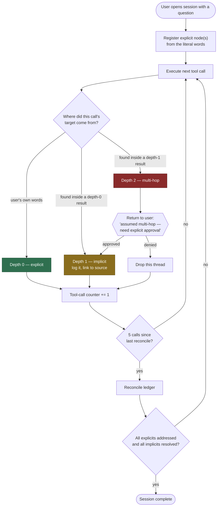
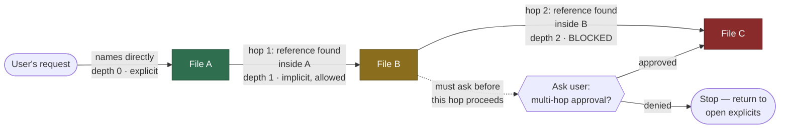

# Explicit/implicit gating for agent tool use

Status: brainstorm, captured 2026-09-16. No implementation started — this is a design
conversation written down, not a spec ready to build from. Nothing here has been coded or
tested.

## The problem this answers

Agents (Claude Code sessions, this one included) repeatedly fail in three ways: solving a
problem other than the one asked, treating an inferred issue or solution as if it were stated,
and not doubting a conclusion once it sounds fluent. The sharpest diagnosis reached in this
conversation: **every action an agent takes, including a plain tool call like reading a named
file, is a prediction, not an understanding.** There is no category of action that is inference-free
— so a design that treats some actions (reads) as safely explicit and only gates others
(conclusions) is a false floor. The actual thing worth gating is **provenance**: whether the
target of an action came from the user's own words, or was discovered by the agent along the
way.

## Design settled in this conversation

1. **Ledger model.** Every session tracks two node types: *explicit* (traceable to the user's
   literal words) and *implicit* (an agent-drawn inference). Every implicit node must link back
   to the explicit node(s) it was derived from.
2. **Depth cap of one.** An implicit node may only be one hop removed from an explicit node — no
   implicit may cite another implicit as its parent.
3. **Checkpoint cadence.** After up to 5 tool calls, the agent must reconcile the ledger with any
   implicit assumptions accumulated since the last checkpoint.
4. **Multi-hop gate.** If a tool call's target (a file, a record, an identifier) was named by the
   user, that's depth 0 (explicit). If it was discovered inside something the agent read on its
   own initiative, that's depth 1 (implicit, permitted, but logged with the specific source that
   pointed to it — e.g. "read file B because file A referenced it at line N"). If the agent then
   wants to follow a reference found *inside* that depth-1 material, that's depth 2 — a hard stop.
   The agent must return to the user and say plainly that it has assumed this is now a multi-hop
   operation, and needs explicit approval before continuing.
5. **No exception for trace-shaped requests.** The gate fires at depth 2 every time, even when
   the user's original request was itself phrased as a trace ("find everywhere X is used").
   Decided explicitly: asking is cheap, so there's no case where skipping the check is worth the
   saved friction. ("A quick question... is easy and costs nothing" — the user's words.)
6. **Completion.** A session/request is done when every implicit node has been closed out into
   explicit — nothing inferred is left unresolved when the task ends.
7. **Architecture requirement (a verified fact, not a preference).** An MCP server alone cannot
   block Claude's built-in tool calls (Read/Edit/Bash/etc.) — it can only expose its own callable
   tools for reading and writing the ledger. Enforcement (blocking or asking before a call
   proceeds) requires pairing the MCP with a `PreToolUse` hook that consults the ledger's state
   before the call is allowed to go through. Confirmed against the current Claude Code hooks
   reference and guide (fetched and grepped directly, not recalled from training data): `Stop`
   and `PostToolUse` hooks use a top-level `decision: "block"` field with a `reason` that gets fed
   back to Claude as the next thing to address; `PreToolUse`/permission-style hooks return
   `allow`/`deny`/`ask`; `UserPromptSubmit` injects `hookSpecificOutput.additionalContext` before
   Claude starts processing a turn; a `Stop` hook can check `stop_hook_active` in its input and
   Claude Code itself overrides a Stop hook after 8 consecutive blocks (raisable via
   `CLAUDE_CODE_STOP_HOOK_BLOCK_CAP`) so it can't trap a session forever.
8. **v1 build target found and verified.** `langchain-claude-cli` (PyPI, MIT, built on Anthropic's
   official `claude-agent-sdk`) is the dependency this project actually installed. Read directly
   from its installed package metadata and source, not recalled: its `ChatClaudeCli` model defers
   *all* `bind_tools` tool execution back to caller code — "the model never runs your tools — it
   returns `tool_calls` and your code decides." So the ledger's gate for LangChain-bound tools can
   live entirely in LangChain-space, wrapping the returned `tool_calls` — no `PreToolUse` hook or
   MCP server required for that surface. Item 7's requirement still applies, unchanged, to Claude
   Code's own built-in tools (Read/Edit/Bash) run via this library's agentic mode — those execute
   inside the CLI subprocess itself and are out of scope for v1 (see decisions below).

## Diagrams

### The session loop

Shows the two loops together: the recurring tool-call/checkpoint cycle, and the ask/approve
sub-loop that fires whenever a call's target is two hops removed from anything the user actually
said.

### Where the hops are

Zooms into the multi-hop gate itself: which hop is free, which hop is always blocked, and what
happens at the gate.

## Decisions settled in the build-scoping follow-up (2026-09-16)

A later conversation, same day, moved this from brainstorm toward an actual build: a new project
(`langchain-claude-test`, this repo) with `langchain` and `langchain-claude-cli` as dependencies.
The following are the user's own direct answers to direct questions — explicit, not inferred —
and each one closes an item from the original "Open" list below.

9. **v1 scope: LangChain `bind_tools` calls only.** The ledger gates tool calls made through
   `bind_tools` (already deferred to caller code by `ChatClaudeCli`, per item 8). Gating Claude
   Code's own built-in agentic tools (Read/Edit/Bash, run in-process inside the CLI) is explicitly
   deferred to a later, not-yet-designed phase.
10. **Promotion mechanism resolved: option (a), never.** No implicit node self-promotes to
    explicit under any condition, including low-stakes/operational ones — every implicit requires
    the user's own confirmation. Closes former Open item 1; the assumption that had pointed toward
    this answer is now confirmed rather than merely suspected.
11. **Checkpoint mechanics resolved: rolling, every 5 calls.** The counter resets after each
    reconcile and the cycle repeats for the life of the session — matching what the session-loop
    diagram above already depicted. The ledger's own bookkeeping calls (registering a node) are
    exempt from the count. Closes former Open item 2.

Tooling installed alongside these decisions (via `bunx skills add`, from `langchain-ai/langchain-
skills` and `daymade/claude-code-skills`): `langchain-middleware`, `langchain-dependencies`,
`langgraph-human-in-the-loop`, `claude-code-hooks`. Not decisions — recorded here only because
they'll shape how the settled items above actually get implemented.

## Open — not yet decided

1. **Coverage gap.** The multi-hop gate only catches drift that shows up as chained tool calls
   (file A leads to B leads to C). It does not obviously catch an agent drawing an unsupported
   conclusion from a *single* document with no further tool call involved — an assertion that
   overreaches what was actually read, with no second hop to gate. Whether this needs a separate
   mechanism (gating at the point of assertion/characterization, not just at chained references)
   is unaddressed. Re-raised in the follow-up conversation; still not answered either way — deferred
   vs. designed-for-now is an open question, not a default.
2. **Provenance-computation mechanism, for the v1 `bind_tools` scope.** Item 8 above resolves the
   *architectural* question — no hook is needed for this surface. What's still unresolved is *how*
   a tool call's depth actually gets computed: deterministic text-match of argument values against
   the message history (cheap, auditable, brittle to paraphrasing), the model self-reporting its
   own source for each call (flexible, but trusts self-report — arguably the exact failure mode
   this whole document exists to guard against), or a hybrid (text-match first, model justification
   only as a fallback, logged as lower-confidence). Raised in the follow-up conversation, not yet
   answered.
3. **Implementation feasibility of provenance tracking for built-in tools.** The original form of
   this question, unresolved and now out of v1 scope per item 9: whether a `PreToolUse` hook's
   input actually carries enough information to compute "was this reference present in the user's
   original message or a prior explicit" and "was this reference discovered inside a specific
   prior tool result" for Claude Code's own built-in tools. This likely requires the hook script to
   keep its own session-scoped state (e.g. a local file keyed by session ID), since each hook
   invocation is a stateless process. Not yet designed or checked against real hook input/output —
   parked for whenever the built-in-tools phase is scoped.

## Assumptions made while writing this plan

Flagged per the same discipline this document describes — these are inferences made in this
conversation that were never explicitly confirmed, kept separate from what was actually decided
above.

- The "operational vs. scope-defining" split (which implicit actions are low-stakes enough to
  maybe self-promote) is a framing introduced during this conversation, not the user's own
  language. It has not been adopted or rejected as terminology.
- An assumption was made that a fully literal "no implicit may ever be acted on" rule would be
  impractical and would need a low-stakes carve-out. The user's later answer on the multi-hop
  question ("asking is cheap") tolerates more friction than that assumption expected — the
  assumption may have pointed in the wrong direction.
- "5 tool calls" was read as a recurring checkpoint (every 5 calls) rather than a single
  session-wide budget. Never confirmed either way (see Open, item 2).
- The ledger's own bookkeeping calls were assumed to be exempt from that 5-call count. Never
  confirmed — just a default carried silently into the description above.
- A change to the completion criterion was proposed — "all implicits resolved (promoted or
  explicitly rejected)" instead of the user's literal "all implicits turned into explicit" — to
  prevent the criterion being gamed by force-labeling a wrong guess as explicit. This has **not**
  been agreed to; the settled section above uses the user's original wording, not this one.
- Running the same judgment twice and checking for disagreement ("double-run divergence") was
  floated as a complementary, non-self-report ambiguity signal. It was never picked up or decided
  on either way.
- "Tool hooks for Claude" was read as Claude Code hooks generally, and answered by pointing
  specifically at `UserPromptSubmit`, without first confirming that was the intended scope of the
  question.
- None of this has been built or run. The hook mechanics cited above were checked against the
  actual documentation text (fetched and grepped directly), but whether a working provenance-chain
  tracker is actually implementable within a hook's real input/output constraints is untested, not
  merely unconfirmed by the user.
