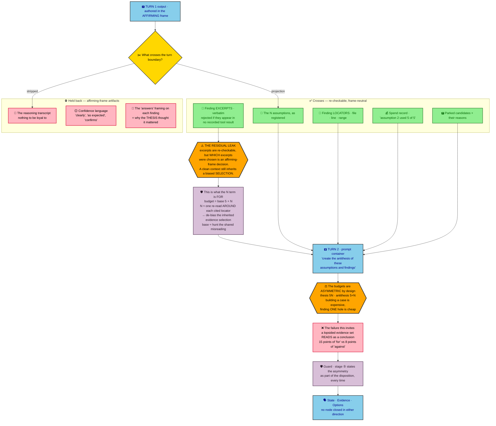
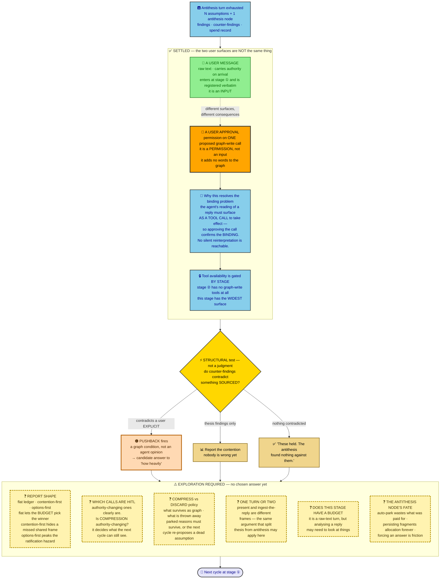

# Budgeted flow — priced spend, staged tool availability, adversarial separation

Captured 2026-09-17, rewritten 2026-09-18 after a second working session. This document states
the **current** design. Where a thing is settled it says so and says why; where it is open it says
what would settle it; where nobody knows yet it is marked **exploration required** rather than
filled in with a guess.

Nothing here has been built. No code in `src/` implements any of it — `src/` still runs the
fixed-order pipeline described in section 5, which this design replaces.

`PLAN.md` and `docs/design/updated-flow-2026-09-16.md` are earlier records and are not edited by
this document. Where they conflict with it, this document is current and they are history.

## How to read this document

The document is written in the registers the system it describes would enforce. This is
deliberate — a plan for provenance discipline that does not itself keep provenance is the failure
it exists to prevent.

| Marker | Meaning | Authority |
|---|---|---|
| **E** | **Explicit.** The user's own words, quoted verbatim, typos preserved. | Settled. The only authority in this document. |
| **O** | **Observed.** A quotation from this repository with a locator. Re-checkable. | None. A witness, not a finding. |
| **A** | **Assumption.** Written by the agent. Unconfirmed. Each names what would settle it. | None. |
| **X** | **Exploration required.** A known unknown, flagged as such by the user. No answer is chosen. | None. Not a gap to be quietly filled. |

An **A** item the user has not answered is open, regardless of how reasonable it reads. An **X**
item is not an invitation to pick the most plausible option and proceed.

---

## 1. The shape

One **cycle** runs three turns and five stages. A cycle begins with a user message and ends with
one, and each turn is a mini-session inside the super-session (**E13**).

Two mechanisms carry the design, and they are different things:

- **Availability is staged.** Which graph tools exist at all is a function of the stage the graph
  is in. The agent never chooses what happens next, and never chooses what it is allowed to write.
- **Volume is priced.** Within a stage, each tool call decrements a budget (**E5**). Exhaustion
  ends the stage.

```mermaid
flowchart TD
    Start(["👤 User message · raw text · carries authority"]) --> VB

    subgraph TURN1["🅰️ TURN 1 · AFFIRMING FRAME"]
        direction TB

        subgraph S1["① Prompt + fact extraction"]
            direction TB
            VB["📌 Register the prompt VERBATIM<br/>authority: the user · no inference"]
            VB --> EXTR["🤖 Extraction pass · AGENT<br/>selection IS inference → no authority yet"]
            EXTR --> HG{{"🙋 HITL on the TOOL CALL<br/>propose_fact → approve?"}}
            HG -->|"approved"| FACT["🟢 EXPLICIT<br/>the only thing spend may serve"]
            HG -->|"denied · silence"| NEG["🅿️ Parked WITH its reason"]
        end

        subgraph S2["② Budget context pass — go WIDE"]
            direction TB
            ORI["🗺️ Orient · prompt × project landscape<br/>NO graph-write tools in this stage<br/>→ it forms no claim, so it closes nothing"]
            ORI --> SPW["💸 Spend the UNATTACHED base pool"]
            SPW --> RDY{"🎯 Enough to name N readings?"}
            RDY -->|"not yet"| SPW
        end

        subgraph S3["③ Assumption pass — form, then fund"]
            direction TB
            FORM["🧩 write_assumption × N<br/>agent-authored → NOT HITL<br/>each must be a place info can LAND"]
            FORM --> SPD["💸 Spend ≤ 5 per assumption<br/>caps set by the graph, never by the agent"]
            SPD --> FIND["📎 attach_finding<br/>locator + excerpt · sourced, NOT fact"]
            FIND --> Q1{"🔢 N × 5 spent?"}
            Q1 -->|"no"| SPD
        end

        FACT --> ORI
        RDY -->|"yes"| FORM
    end

    Q1 -->|"yes"| CE1["✂️ TURN BOUNDARY · projection replaces transcript<br/>unspent thesis budget cannot cross<br/>→ non-transferable for free"]
    CE1 --> NOSHOW{{"🚫 The user is NOT shown findings here<br/>reacting to them would RATIFY the frame"}}
    NOSHOW --> CONT

    subgraph TURN2["🅱️ TURN 2 · ADVERSARIAL FRAME · internal turn, no user contact"]
        direction TB
        CONT["📦 PROMPT CONTAINER<br/>'create the antithesis of these<br/>assumptions and findings'"]
        CONT --> ANTI["⚔️ write_antithesis · it is a NODE<br/>no affirming transcript in context<br/>→ nothing to be loyal to"]
        ANTI --> ADM{"🔎 Admissible?<br/>name the call that would move it"}
        ADM -->|"no"| REAU["🔁 Re-author · 'nothing to attack'<br/>is NOT a permitted output"]
        REAU --> ANTI
        ADM -->|"yes"| SPA["💸 Spend base 5 + N<br/>N ≈ one re-read per assumption<br/>base ≈ the shared-misreading hunt"]
        SPA --> FIND2["📎 Counter-findings"]
        FIND2 --> Q2{"🔢 5 + N spent?"}
        Q2 -->|"no"| SPA
    end

    Q2 -->|"yes"| CE2["✂️ Turn boundary · projection"]

    subgraph TURN3["🅲 TURN 3 · PRESENT + RECONCILE — widest tool surface · ⚠️ EXPLORATION REQUIRED"]
        direction TB
        PRES["🗣️ PRESENT prompt container<br/>graph + findings + original prompt + facts<br/>→ what is there · how it relates to the ask<br/>what is missing · what is NOT known<br/>+ suggestions for moving forward"]
        PRES --> ASYM["⚖️ State the budget asymmetry<br/>thesis 5N vs antithesis 5+N<br/>or a lopsided evidence set reads as a conclusion"]
        ASYM --> HAND(["⏸️ Hand off · raw text to the user"])
        HAND --> REPLY(["📨 User reply · raw text · carries authority"])
        REPLY --> ANLZ["🤖 Analyse the reply<br/>→ emit graph-write TOOL CALLS<br/>the proposed call IS the binding, made visible"]
        ANLZ --> TOOLS{{"🙋 HITL on the authority-changing calls<br/>promote_fact · close_node · supersede<br/>compress · discard are ⚠️ unresolved"}}
        TOOLS --> APPLY["✂️ Apply · context edit is now<br/>an approved tool call, not an automatic step"]
    end

    CE2 --> PRES
    APPLY --> CYCLE(["🔄 Next cycle at stage ①<br/>each cycle is a mini-session in the super-session"])

    LED[("🗂️ Ledger · explicits · assumptions · antithesis · findings · spend")]
    FACT <--> LED
    FIND <--> LED
    FIND2 <--> LED
    APPLY <--> LED

    classDef startEnd fill:#E6E6FA,stroke:#333,stroke-width:2px,color:darkblue
    classDef node fill:#87CEEB,stroke:#333,stroke-width:2px,color:darkblue
    classDef decision fill:#FFD700,stroke:#333,stroke-width:2px,color:black
    classDef explicit fill:#90EE90,stroke:#2E7D2E,stroke-width:2px,color:darkgreen
    classDef implicit fill:#F0D58C,stroke:#8a6d1d,stroke-width:2px,color:black
    classDef gate fill:#FFA500,stroke:#333,stroke-width:3px,color:black
    classDef blocked fill:#FFB6C1,stroke:#DC143C,stroke-width:2px,color:black
    classDef spend fill:#D8BFD8,stroke:#5c3d5c,stroke-width:2px,color:#2a1a2a
    classDef brain fill:#FFE4B5,stroke:#8a5a1d,stroke-width:3px,color:#3a2409
    classDef explore fill:#FFF3B0,stroke:#b38f00,stroke-width:3px,stroke-dasharray:6 3,color:#3d3000
    classDef store fill:#E6E6FA,stroke:#333,stroke-width:2px,color:darkblue

    class Start,HAND,REPLY,CYCLE startEnd
    class VB,ORI,CE1,CE2,ASYM,REAU,CONT node
    class HG,ADM,RDY,Q1,Q2 decision
    class FACT explicit
    class EXTR,FORM,FIND,FIND2,ANLZ implicit
    class HG,NOSHOW,TOOLS gate
    class NEG blocked
    class SPW,SPD,SPA spend
    class ANTI brain
    class PRES,APPLY explore
    class LED store
```

### The stages

| # | Stage | Turn | Budget | Graph writes available | HITL |
|---|---|---|---|---|---|
| ① | Prompt + fact extraction | 1 | see **A1** | register prompt verbatim · propose fact | **yes**, on `propose_fact` |
| ② | Budget context pass | 1 | unattached base pool | **none** — the stage forms no claim | n/a |
| ③ | Assumption pass | 1 | 5 per assumption | write assumption · attach finding | no — agent-authored |
| ④ | Antithesis pass | 2 · internal | base 5 + N | write antithesis node · attach finding | no — agent-authored |
| ⑤ | Present + reconcile | 3 | **X5** | widest surface: promote fact · close node · compress · discard · reify · supersede | **yes** on authority-changing calls; see **X2** |

The **staging principle** is settled (**E29**). The individual tool *names* in that column are not:
`write assumption` and `compress fact` are the user's own examples, `compress`, `discard` and
`register` come from **E31**, and the rest are the agent's guesses at what each stage needs. Treat
the column as the shape of the surface, not as a built API.

---

## 2. Settled — the user's explicits

Quoted verbatim. These are the only authority in this document.

### On pricing and spend

**E1 — Tool use is priced, not gated *per call*.**
> "I want tool usage from claude registered to point values and not have the actual tool use gated in the way it originally was."

This is not in tension with staged availability (**E29**). What **E1** removes is the per-call
approval-on-depth-and-severity gate. What **E29** adds is that a stage simply does not carry tools
outside its job. One is discretion at the moment of the call; the other is the shape of the surface.

**E5 — A budget decrements per call. Example values given.**
> "the agent would have a budget in this phase that gets reduced every time a tool call is used. Read tools might be -2, survey skills might mb -1 (like ls, tree, etc.), webfetch = 3, and so on."

**E6 — Exhaustion forces a reply. The user's reply refreshes.**
> "once they run out, they must reply back to the user. THe user would reply and refresh the budget of tools."

**E8 — Cost may not be attached to the direction of a conclusion.**
> "Falsification cannot be free, because agents do not know the difference between affirming something and discounting it in terms of evidence gathering. It is not which way they go, it is when they stop and how they approach it."

**E11 — The two purposes of pricing.**
> "The first is to get the agent to think about their tool use wisely, and not polute their context by reading outdate and uncessary files. The second is to make the agent go wide before going deep."

**E15 — Breadth and restriction are solved by per-assumption tool call limits.**
> "I plan to solve this by having tool call restrictions per assumption."

**E16 — Reconciliation is free, within a limit.**
> "I think reconcilation can be free up to an extent."

**E23 — Targeted refresh is permitted.**
> "I think supporting small calls to refreshg budget on certain things is alright as well."

**E25 — The agent never sets values and never refreshes itself.**
> "the agent can never set their own values. These values are set inside the graph flow. The agent can never manually refresh."

**E26 — Control over values belongs in the GUI layer.**
> "I would obviously want control over it, if we can bake that kind of control into the custom gui wrapper over the top of the sdk, then that would be good."

### On assumptions

**E2 — An assumption is an interpretation of the request, never a record of tool use.**
> "the agent wouldnt actually record their tool use as an assumption, the assumption of an agent is always an interpretation of what the user is asking"

**E3 — Assumptions are plural: the scenarios worth exploring.**
> "the agent should consider the number of scenarios to explore and record them as assumptions"

**E4 — Spend serves the explicit, narrowed by the assumption.**
> "Then the next stage would follow with tool calls to extrapolate information out of the interaction surface in service of the original explicit, narrowed by the assumption."

**E14 — Restriction on open assumptions, and breadth, are the load-bearing problems.**
> "The two correct are that the restriction on the open assumptions is critical, and the second is the breadth."

**E17 — The shape of a turn's graph fragment.**
> "an initial prompt, 3 edges and 3 assumption nodes. The edges describe the flow of the prompt to the assumption, i.e., why the agent inferred the way that they did. The 3 nodes are the assumption that warrants tool calls."

**E18 — Admissibility: an assumption must be a place information can land.**
> "we want assumptions to be avenues available for information to stick. There is no point in assuming something unprovable."

**E19 — Orientation is a refreshed budget, and is where landscape meets prompt.**
> "I think you're right that the orientation should be a refreshed budget. The orientation in of itself is letting the agent reconcile the user input against the landscape of the project, and then assuming based on that, which is fine."

### On fact and authority

**E7 — Fact registration is HITL, always.**
> "A fact isnt a fact until it is explicitly registered via a user, so all tool calls that register facts/explicits are hitl approvals."

Note the literal subject: *tool calls* are what carry the HITL approval. See **E28**.

**E9 — The agent may never state fact. Fact is the user's.**
> "Fact is for the user, and only when the agent reaches a true point of contention in which the evidence heavily does not support the user's facts and exxplicits, does the agent then push back."

**E10 — A direct request for judgment is an exception.**
> "This will not be the same for 'give me options' or 'what are your impartial thoughts', because that's a direct request."

**E20 — The agent may not close a node in either direction.**
> "I still think an agent shouldnt be allowed to factually invalidate in the same way they are not ultimately allowed to factually validate."

**E28 — A user message and a user approval are different surfaces.**
> "There's a big difference between a user message, and the user approval of an agent tool call."

**E29 — Graph tool availability is gated by stage.**
> "For the most part, the availablities of the graph tools (like write assumption, compress fact, etc.) are gated by the stage of the agent graph."

### On the antithesis

**E27a — The antithesis exists to force the agent to examine its own assumptions, and the two frames cannot share a task.**
> "the point of the antithesis is requiring the agent to actually think about whether their assumptions are correct. An agent cannot think they are right and wrong in the same task because it's too confusing for them. The other option is one antithesis per assumption, but that then doubles the tool calls"

**E27b — Separate turn, base + N budget, to keep the thought tasks from conflicting.**
> "actually I think the easiest way to do it is just a base + N assumption tool call budget pass as a separate turn. This means if there are 3 assumptions, where each assumption has a budget of 5, the agent registers findings against the assumptions in one turn. THe next phase goes as the antithesis phase that gives the agent a prompt container that says 'create the antithesis of these assumptions and findings' and the budget has the base (5) + assumption N (3) = 8. These can obviously be changed, but the idea is to separate the thought tasks to be as unbiased and not conflict"

**E27c — The antithesis is a node.**
> "it is a node, definitely. Following the end of the antithesis, it would then drop into the phase of reconciling with the user. Though this stage is the most up in the air in my mind"

### On the turn, the stages, and the close

**E13 — Each turn is a mini session inside a super session.**
> "each conversation turn is a mini session as a part of the super session"

**E12 — Context editing after each iteration; the graph becomes the context.**
> "context editing would occur after each full iteration and facts/explicits are registered. This means all tool calls are replaced in the session context with the output of the graph and the relevant pieces of the docs that are attached to them."

**E30 — The four stages, and that fact extraction is an agent pass under HITL.**
> "1. prompt start and fact extraction where fact extraction is an agent pass, but is hitl gated. This shouild be in a bounding box as a 'stage'. 2. Budget context pass (gather context enough to make assumptions). 3. assumption pass, register assumptions and always one antithesis. Basically reasonable assumptions and then a required pass about trying to disprove their own assumptions. 4. tool quota met, return to user"

The table in section 1 runs to five stages because **E27b** moved the antithesis into a turn of its
own and **E31** gave the close its own container. Stages ① and ② are as quoted; the quoted stages 3
and 4 are stages ③, ④ and ⑤.

**E31 — What the present stage presents, and why it holds the most tools.**
> "if we imagine that following anthithesis stage the prompt for the agent might be a present to the user prompt that takes the given graph, information, and the original prompt + facts and presents what is there, how it relates to the user question, and what's missing, and what they don't know, and then suggestions for moving forward. This stage would most likely have the most tools available, because it's a raw text turn, the agent analysizes the reply and would have to break the tool calls into differentiating what should be compressed, what tool information to throw away, what new facts to register, etc."

**E32 — The present stage is unresolved and must be explored, not designed by assumption.**
> "I think this needs to be recorded as exploration required, since we dont actually know the best way forward."

**E21 — What happens at a stop: state, evidence, options.**
> "Perhaps each of those end up as an agent simply asking the user \"i have this open, I've done this with this evidence, here are some options\""

**E22 — Options are helpfulness, not a decision surface, and may be wrong.**
> "the options are not set in stone options. THey are the agent attempting to be helpful with theinformation they have. They are suggestions of things they are assuming they can do, which will often be wrong and that's fine."

**E24 — Options are never in the graph and are not a tool call.**
> "options are NEVER part of the graph, and you shouldnt even think of them as something like a tool call. It's simply what happens at some stop points."

The "suggestions for moving forward" in **E31** are these options. They are prose in the presented
text. They are not nodes and they are not calls.

### On values, personas, and what to build first

Added 2026-09-18, in answer to questions raised while scaffolding the control graph
(`src/langchain_claude_test/graph_v2/`). These are the root the scaffold's defaults derive from.

**E33 — Every number is provisional. Defaults are permitted, but must be marked as unset.**
> "All of the numbers will need to be tested and tweaked, and there is a reasonable case for a settings file upload for persona types, where some are heavy thinkers and others dont need that much. So in this sense, we can just pick defaults but make sure to not that they are not set."

This supersedes the refusal-on-missing-value posture the scaffold started with. It also introduces
**personas**: one set of budgets per persona, supplied by a settings file, because a heavy thinker
and a light one do not want the same caps. Marking is not optional — a run that cannot say which of
its limits nobody chose is reporting on a configuration nobody chose.

**E34 — Fact extraction is parked until a base loop runs.**
> "I think we can put this to the side for now. The fact extraction has more nuance at the moment than i anticipated, so I'd like to see a working base loop before extending the finer details."

This answers **A1** by deferring it, and it sets the build order: the loop turns over first, the
finer details after. The nuance the user refers to is not recorded here because it was not stated.

**E35 — The present stage has no budget. It analyses and reports.**
> "delay for now, but no this is just a analyze and report stage at the moment."

This answers **X5** for now: no pool, so no priced call. "At the moment" is the user's word, so
this is the current answer rather than a permanent one. Note the consequence — the stage cannot
gather anything new, so what it reports is exactly what the two earlier turns bought.

**E36 — The remaining detail is out of scope at this stage of the design.**
> "The rest of these things are far to detailed for this statge in the design."

Said of a list covering: who caps the assumption count, what bounds re-authoring, whether in-graph
bookkeeping writes are priced, whether compression needs approval, what survives compaction, where
a new message enters, whether an antithesis may supersede, the tool names, and where state is
stored. Each now runs on a marked placeholder rather than a refusal — see **E33**. The first of
them is since answered — see **E37**.

**E37 — There must be a limit on how many assumptions may be produced.**
> "there should be a limit on the amount of assumptions produced"

Added 2026-09-18. The *limit* is now required; the *number* is not given, so it stays a marked
placeholder under **E33**. The two are recorded separately because they are different kinds of
fact: a run may report that nobody has chosen the value, but it may not run without a ceiling.

This closes the one item **E36** set aside that the scaffold could not proceed without. The turn
after orientation is funded at the per-assumption rate times the count, and the turn after that at
base plus the count — so an agent free to choose the count would be choosing its own budget, which
**E9** forbids. The ceiling is therefore graph-owned, enforced as a refusal by the tool that writes
a reading rather than by discarding readings afterwards, and the model is told the number and told
it is not his to raise.

---

## 3. Stage by stage

### 3.1 Stage ① — Prompt + fact extraction · turn 1

Two object classes with different authority live in this stage, and keeping them apart is the
stage's whole job.

- **The prompt.** Registered verbatim. Its authority is the user's and no inference is involved in
  admitting it.
- **Candidate facts.** Produced by an agent extraction pass (**E30**). Selection, boundary-drawing
  and paraphrase are inference, so a candidate carries no authority. It becomes explicit only when
  the user approves the `propose_fact` call (**E7**, **E28**).

A denied or unanswered candidate parks **with its reason**. `parked` already carries the right
semantics in the built ledger — *"implicit: asked, no answer — never self-resolves"*
(`ledger/models.py:32`). If the reason does not survive compaction, the next cycle re-extracts the
same candidate and pays for it again, which is **E11**'s first purpose violated by the mechanism
meant to serve it.

**A1 — Whether the extraction pass costs budget is unspecified.** It is agent work over prose and
may need to look at things. **Deferred 2026-09-18 by E34** — the stage is parked until a base loop
runs, and it currently uses a marked placeholder. *Settled by:* the user assigning stage ① a budget
or declaring it free.

### 3.2 Stage ② — Budget context pass · turn 1

Orientation: the agent reconciles the user's input against the landscape of the project (**E19**).
It spends from an **unattached** pool — one not tied to any assumption, because the assumptions do
not exist yet. It carries **no graph-write tools at all**, which is what makes "forms no claim"
enforceable rather than merely intended.

This stage is where **E11**'s "wide before deep" is realised. It is not produced by unit prices —
an agent with ten points can spend all ten on one chain — it is produced by the stage boundary:
per-assumption budget does not exist until assumptions do, and assumptions are not formable without
the wide pass. Prices are then left with one job, context hygiene, which is the job they are good at.

**A2 — Whether stage ②'s pool is the same named constant as the antithesis `base` is unspecified.**
**E27b** gives `base = 5` for stage ④. Stage ②'s value is not stated. **Under E33** the scaffold now
runs on a marked placeholder of 5 — matching `base` because a number was needed, which is not the
same as judging them the same constant. *Settled by:* the user naming it.

### 3.3 Stage ③ — Assumption pass · turn 1

N interpretations of what the user is asking (**E2**, **E3**), each an avenue where information can
land (**E18**). The edge carries why the agent inferred as it did (**E17**). Assumptions are
agent-authored, so they are **not** HITL — they carry no authority and claim none.

Each assumption receives **5 points** (**E15**, **E27b**), set by the graph and never by the agent
(**E25**). At **E5**'s prices, 5 points is two reads and a survey, or a webfetch and a read.

Spend produces **findings**: a locator, a verbatim excerpt, and what it speaks to. The built
`Source` model already holds exactly this shape, including the constraint that an excerpt
*"appears in none of them is rejected"* (`ledger/models.py:100-131`). A finding is sourced material.
It is not a fact.

**A3 — Admissibility should be enforced at formation, not later.** An assumption must name the call
whose result would change the agent's belief about it; no nameable call, no node. The field already
exists as `EvidencePlan.expect` (`session/phases.py:87`) but sits after sign-off, where it functions
as a plan rather than a filter. At formation it becomes the gate on what may exist, and the same
statement defines the allocation. *Settled by:* the user confirming **E18** is enforced at the schema
level.

**A4 — Nodes should hold claims; actions belong to allocations.** The form "the user is discussing X
→ therefore I should Y" puts an action in the node, and "I should Y" is unprovable. Proposed split:
the edge carries "the user is discussing X, handled in the Y subsystem", the node holds "X's
behaviour is determined by Y", the allocation holds the read of Y. *Settled by:* the user accepting
or rejecting the split.

**A5 — One edge should carry both justifications.** Formation reasoning (**E17**) recorded before
spend, and the finding (**E12**) recorded after. The edge then holds the whole lifecycle of one
derivation, which makes the edge — not the node — the unit that must survive compaction.
*Settled by:* the user confirming the edge is the compaction unit.

### 3.4 Stage ④ — Antithesis pass · turn 2, internal

The agent is handed a prompt container — *"create the antithesis of these assumptions and
findings"* — and a budget of **base 5 + N** (**E27b**). With three assumptions that is 8.

**Why a separate turn rather than a separate prompt.** An agent cannot hold "right" and "wrong" in
one task (**E27a**). A separate task only *asks* for impartiality. A separate turn means the context
edit (**E12**) has already run, so the affirming transcript is not in context at all and there is
nothing to be loyal to. The unbiasing is physical rather than instructed, and it needs no new
machinery: **E13** already makes turns the unit, **E19** already refreshes budget per turn, **E25**
already puts the value inside the graph flow.

**The antithesis is a node** (**E27c**), not a property of each assumption. One antithesis aimed at
the *set* asks "what reading do all N miss?" — which is the only form that can catch a misreading
the whole set shares, because a per-assumption rival is authored inside the very frame it was meant
to question. It is also cheaper, though less so than the node count suggests: `N+1` nodes rather
than `2N`, but the antithesis turn is funded at `base + N` rather than at one node's cap, which
section 4 puts at `6N+5` points against `10N`.

It is admissible on the same terms as any assumption (**E18**), and **"there is nothing to attack"
is not a permitted output** — for the same reason **E8** rules out the agent classifying its own
search, it does not get to classify the attack as unnecessary.

**E8 still holds.** "Falsification cannot be free" governs evidence gathering — *when* they stop and
*how* they approach it. Authoring a rival reading is not evidence gathering. So the authoring is free
and the spend is priced at the same rates as the thesis.

**What the two budget terms are for.** Findings cross the turn boundary as locator plus excerpt,
which is re-checkable. But *which* excerpts were chosen is an affirming-frame decision, so turn 2
inherits a biased **selection** of evidence even with a clean context. That is what the terms
answer, and it is why the formula is not arbitrary:

- **`N`** ≈ one re-read *around* each cited locator — de-biasing the inherited selection
- **`base`** ≈ the working pool for hunting the misreading the set shares

Raise `N` when the thesis' evidence selection is not to be trusted; raise `base` when the misreading
hunt needs depth.

**A6 — `Source.answers` should not cross the turn boundary.** It holds *"Verbatim words from the
EXPLICIT that this evidence speaks to"* (`ledger/models.py:122`) — the thesis explaining why the
evidence mattered. Passing it hands turn 2 the affirming frame in one field. *Settled by:* the user
ruling on what the projection contains.

**A7 — The antithesis node's parent edge has no obvious source.** `ledger/graph.py:181 form_implicit`
requires the parent be an explicit, and `check_invariants` (`ledger/graph.py:431`) requires exactly
one `grounds` parent. So the antithesis must ground to an explicit, leaving its actual reasoning —
"these N readings all miss X" — with nowhere to live but the edge's formation text.
*Settled by:* the user deciding whether the antithesis needs an edge kind of its own.

**A8 — The budgets are asymmetric and the report must say so.** 5N for the thesis against 5+N for
the antithesis. The asymmetry is defensible — building a case is expensive, finding one hole is
cheap — but it means the evidence set arriving at stage ⑤ is lopsided by construction, and a
lopsided evidence set *reads* as a conclusion. Unless stage ⑤ states the asymmetry every time, the
budget design quietly does the concluding **E20** forbids. *Settled by:* the user accepting the
disclosure as mandatory.

**A9 — The user must not see turn 1's findings before turn 2 runs.** **E6** makes exhaustion force a
reply, but if that applied at the turn 1 boundary the user would react to affirming findings before
anything challenged them, and their reaction would ratify the frame. This needs a distinction the
design does not currently draw: an **internal turn** (exhaustion → the graph refreshes → next stage,
no user contact) against a **user turn** (exhaustion → present). Both remain mini-sessions under
**E13**; only the user turn presents. *Settled by:* the user confirming internal turns exist.

### 3.5 Stage ⑤ — Present + reconcile · turn 3 · ⚠️ exploration required

The stage takes the graph, the findings, the original prompt and the facts, and presents what is
there, how it relates to the user's question, what is missing, what is not known, and suggestions
for moving forward (**E31**). It then takes the user's raw-text reply and turns it into graph-write
tool calls — what to compress, what to throw away, what to register (**E31**). It holds the widest
tool surface in the cycle.

**E32 marks this stage as exploration required.** What follows separates the part that is settled
from the part that is not. The **X** items are not to be resolved by picking the most plausible option.

#### Settled here

**The two surfaces are different** (**E28**). A *user message* is raw text that carries authority on
arrival and enters at stage ①; it is an input. A *user approval* is permission on one proposed
graph-write call; it is a permission, and it adds no words to the graph.

**This resolves the binding problem.** The risk in reading a free-prose reply is the agent silently
deciding what the user meant — the same self-report the rest of the design deletes, in the worst
possible place, because a misread reply rewrites the graph. Under **E28** plus **E29** it is not
reachable: the agent's reading only takes effect *as a tool call*, and the call is what the user
approves. Approving the call confirms the binding, not the claim.

**A10 — Pushback has a structural trigger.** **E9** allows pushback only where evidence "heavily"
does not support the user's facts. The antithesis turn produces the material that makes this
measurable without judgment: pushback fires when counter-findings contradict a user **explicit**;
where they contradict only thesis findings it is a contention and nobody is wrong yet; where nothing
is contradicted the honest report is "these held." Both sides are sourced, so the contradiction is a
graph condition. *Settled by:* the user accepting this as the **E9** threshold, or naming another.

#### X — exploration required

**X1 — Report shape.** Three candidates, three different failure modes. A **flat ledger** conceals
nothing and concludes nothing, but a skimming user picks the best-funded node — and funding was
decided by the budget formula, not the evidence, so the honest shape launders the budget into a
conclusion. **Contention-first** leads with where the antithesis bit and collapses the rest to
"these held"; its ordering is structural rather than editorial, which is the only kind **E20**
permits, but "these held" also covers the case where the antithesis *missed* a shared misreading and
that reads as reassurance. **Options-first** is **E21** literally and is most useful when the user
just wants to move, but it is where the ratification hazard peaks, because options authored across
N+1 contending nodes bury the contention they came from.

**X2 — Which calls carry HITL.** Authority-changing calls clearly do (**E7**). Compression is the
hard case: it decides what the next cycle can still see, which is a kind of authority even though it
registers no fact.

**X3 — Compression and discard policy.** What survives as graph, what is thrown away, and in what
form (**E31**). Parked candidates and rejected assumptions must survive with their reasons or the
next cycle re-proposes dead ground and pays for it — but "keep everything" is not compaction.

**X4 — One turn or two.** Presenting and ingesting the reply are different frames. The argument that
split the thesis from the antithesis may apply again here.

**X5 — Whether the stage has a budget at all.** It is a raw-text turn, but analysing a reply may
require looking at things. **Answered for now by E35** — no budget; the stage analyses and reports,
and opens no pool, so it cannot look anything up.

**X6 — What becomes of the antithesis node.** Auto-parking discards what was paid for. Letting it
persist as a peer leaves N+1 nodes competing for allocation indefinitely. Requiring the user to
answer it is proportionate to what it says — "your frame may be wrong" — but it is forced friction.

**X7 — The E10 case.** Where the original prompt was "give me options" or "what are your impartial
thoughts", this stage inverts: the antithesis stops being a contention check and becomes part of the
deliverable. Whether that is the same stage with a different container, or a different path, is open.

---

## 4. Budget arithmetic

With per-assumption budget 5, antithesis base 5, and **E5**'s prices (survey −1, read −2, webfetch −3):

| | formula | N=3 | N=5 |
|---|---|---|---|
| thesis turn | 5N | 15 | 25 |
| antithesis turn | 5 + N | 8 | 10 |
| **cycle total** | **6N + 5** | **23** | **35** |

For comparison, an antithesis per assumption would be `10N` — 30 at N=3, 50 at N=5 — which is the
doubling **E27a** rejects, and it worsens exactly as breadth grows, which is the thing **E11** is
trying to buy.

Two properties come free from the shape rather than from a rule:

- **Unspent budget is non-transferable.** Turn 1's remainder cannot fund turn 2 because it is a
  different turn. There is no pool to return it to, so an agent cannot abandon a reading early and
  concentrate spend on a preferred one — which is **E8**'s "when they stop", closed structurally.
- **Unspent orientation allowance cannot become assumption budget.** Not for the same reason —
  stages ② and ③ sit inside the same turn, so no turn boundary separates them. It holds because the
  per-assumption caps are set by the graph and the agent cannot add to them (**E25**). The wide pool
  and the deep caps are different pools, not one pool spent in two places.

---

## 5. What exists today — observed, with locators

Quotations from this repository. Re-checkable; not findings. This is what the code does now, and
therefore what has to change.

**O1 — The built pipeline is fixed-order and does not match this design.**
`src/langchain_claude_test/session/runner.py:12-18` lists the order in its own docstring:
extract → orient → assume → SIGN-OFF → evidence → source → reply. `session/phases.py:3` states the
intent: *"The runner calls these in a fixed order, so the model never chooses what happens next."*
The staging principle survives; the stage list does not.

**O2 — Tiers today are not prices.** `ledger/models.py:54` defines
`CallTier = Literal["free", "gated"]`, with the comment that *"Free to call is not free of
provenance"*. Prices replace this pair.

**O3 — Sign-off sits before evidence, which this design reverses.** `session/gate.py:135`, rule
`gated.unapproved-claim`. Locked by `tests/test_tools_and_gate.py:137
test_evidence_before_signoff_is_refused` and `tests/test_runner.py:103
test_the_user_is_asked_before_any_gated_look`. These two tests encode the old contract deliberately;
they are the decision written down, not incidental coverage.

**O4 — A per-claim budget already exists.** `session/gate.py:64`,
`Policy.max_evidence_per_implicit: int = 1`, exhaustion raised as `depth1.budget-exhausted`
(`gate.py:147`) with outcome `ask`. The mechanism is present at 1; this design sets it to 5 and adds
a second pool.

**O5 — The gate already has four outcomes and two modes.** `session/gate.py:27,29`:
`Outcome = Literal["allow", "propose", "ask", "block"]`, `Mode = Literal["observe", "enforce"]`.

**O6 — Fan-out is already legal in the ledger.** `ledger/graph.py:181 form_implicit` constrains only
that the parent be an explicit; `check_invariants` (`ledger/graph.py:431`) requires each implicit have
exactly one `grounds` parent and places no limit on how many implicits one explicit may ground. One
explicit → N assumptions needs no graph change.

**O7 — Sources already carry the compaction payload.** `ledger/models.py:100-131` holds `locator`,
`excerpt` (*"an excerpt that appears in none of them is rejected"*) and `answers`.

**O8 — `parked` already exists.** `ledger/models.py:32` —
*"implicit: asked, no answer — never self-resolves"*.

**O9 — `supersedes` is unbuilt.** `ledger/models.py:44-46` has only `grounds`, with the note that
`supersedes` *"is deliberately NOT built yet"*. See **A11**.

**O10 — Orientation already forms no claim.** `session/phases.py:49`: *"Phase 2 — a free survey.
Forms no claim, so it costs no hop."*

**O11 — Deny-listing the CLI's built-in tool surface did not hold under test.**
`docs/design/updated-flow-2026-09-16.md:678`, Case C: `builtin_tools="claude_code"` plus
`disallowed_tools=["Read"]` — *"LEAKED ANYWAY"*; the model switched to `Bash`. The same section
records that `builtin_tools` is an allow-list whose default (`None`) yields no built-in tools and no
filesystem. See **A12** — this is now load-bearing.

---

## 6. Open — assumptions awaiting a ruling

**A11 — `supersedes` is now load-bearing, not optional.** The antithesis is a node that can win. If
the user accepts it, the N thesis nodes go stale together — that is a supersession, and without the
edge kind it either masquerades as a new explicit, leaving the stale thread open, or silently
overwrites and erases the record of the correction. **O9** records the edge as deliberately unbuilt.
*Settled by:* the user deciding whether the antithesis winning is in scope for this build.

**A12 — Staged availability requires the built-in tool surface to be off.** **E29** only binds if
the model cannot route around it, and **O11** records that deny-listing failed under test while an
unset `builtin_tools` yields no filesystem at all. Every tool must therefore be in-graph.
*Settled by:* the user confirming the in-graph tool surface as the target for this build.

**A13 — Reconciling a new message against the existing graph is unplaced.** **E16** makes it free
within a limit, but the five stages give it no home. The candidate is to fold it into stage ①'s
extraction pass, so that approving a `propose_fact` call confirms the fact *and* its relation to
prior nodes in one gesture. That would also settle what a relation-edge is. *Settled by:* the user
placing reconciliation in a stage.

**A14 — Exhausted-but-open is not yet a state.** **E20** forbids the agent closing a node either
way, but a node that keeps drawing allocation forever fragments the budget across many live nodes
until none resolve — which **E14** names as critical. The proposed split: the agent may close an
assumption's *budget* ("I allocated n, I spent n, here is what came back" — a fact about its own
spending) but never its *truth*. *Settled by:* the user accepting exhausted-but-open.

**A15 — "Refresh b" directs attention; it does not ratify b.** The predictable failure is an agent
reading a targeted refresh (**E23**) as endorsement and reporting b's findings with an authority the
user never granted. Directing spend and ratifying a claim need to be separate states on the node.
*Settled by:* the user confirming the two states are distinct.

**A16 — An option acted on must be reified before it can hold budget.** Options are ephemeral and
unregistered (**E24**), so `b` may be a label in text about to be compacted away. If `b` names an
existing exhausted assumption, refresh grants allocation and nothing else changes. If `b` was an
option, it must first become a registered assumption passing **A3**. *Settled by:* the user
confirming the two paths.

**A17 — An assumption outliving its orientation is stale.** Orientation refreshes per cycle
(**E19**), so an assumption carried across cycles hangs off a landscape reading that no longer
exists. Proposed: stamp each assumption with the orientation it was formed against; a later
orientation contradicting the stamp raises the same structural signal as **A10**. *Settled by:* the
user deciding whether staleness is in scope.

**A18 — What PLAN.md becomes.** This design is in tension with `PLAN.md` items 3 (5-call checkpoint)
and 5 (hard multi-hop stop), and with the sign-off-before-evidence ordering in **O3**. `PLAN.md` has
not been edited. *Settled by:* the user saying whether it is superseded, annotated, or left as
history.

**A19 — What the GUI layer owns.** **E26** gives it value control. Whether it also owns the stop
point, the presentation in stage ⑤, and the approval surface for **E28** is open — **X1** and **X2**
both land there if it does. *Settled by:* the user scoping the wrapper.

**A20 — The turn composition of stages ①–③ is inferred.** **E27b** says findings are registered
"in one turn", which places stage ③. Whether stages ① and ② share that turn is the agent's reading —
stage ①'s HITL approval is a permission rather than a message (**E28**), so it need not end a turn,
but nothing states that it does not. *Settled by:* the user confirming where turn 1 begins.

---

## 7. Diagrams

Sources live beside this document and are validated against the Mermaid parser before embedding.

| Diagram | Source |
|---|---|
| The staged cycle | `diagrams/budgeted_flow_01_activity_staged_cycle.mmd` |
| The antithesis turn boundary | `diagrams/budgeted_flow_02_activity_antithesis_pass.mmd` |
| Present + reconcile | `diagrams/budgeted_flow_03_activity_present_reconcile.mmd` |
