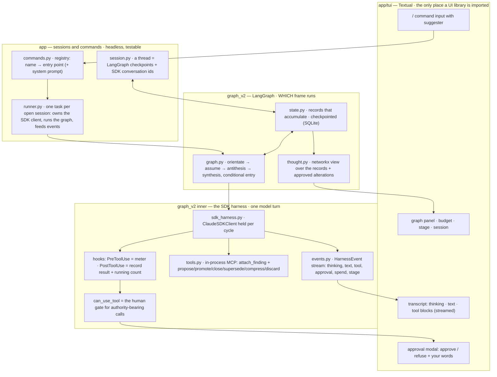

# Build plan — the end-to-end app, 2026-09-19

Status: **answered 2026-09-19 and built the same day.** §5's answers are recorded in §5a;
§6 shows what is done. The one piece deliberately held back is the effect of the gated graph
alterations, proposed for review in `thought-graph-proposal-2026-09-19.md`.

This document is the task list and the design picture for building the thing the earlier
documents describe. It does not restate them. Authority is as before: **E** is the user's own
words, verbatim; **D** is a decision I have taken with its reason, to be agreed or overturned;
**A** is an assumption I am carrying and have marked; **Q** is a question only the user can
answer. Facts about installed software carry a locator and were checked, not recalled.

Prior design records, still current where this one is silent:
`budgeted-flow-2026-09-17.md` (E1–E37), `framework-fit-2026-09-18.md`,
`agent-sdk-control-surface.md`, and the `graph_v2/` package itself.

---

## 1. What is being asked — the user's words, and my reading of each

| # | Their words | My reading (**A** until answered) |
|---|---|---|
| E38 | "build end to end the solution that I have been testing" | The `graph_v2` cycle actually running against the Agent SDK, with a UI in front of it. |
| E39 | "I do not want to rebuild what the claude agent sdk already does, but I do want control over the stateful nature." | Model loop, streaming, session transcripts, interrupts and built-in tools stay the SDK's. What we own is the *state*: the cycle state, the thought graph, the checkpoints, and which frame runs when. |
| E40 | "I've tried to abstract langraph nature, which is fine to an extent but has not be thoroughly tested and integrated." | Keep LangGraph as the stage controller. Test it end to end with a scripted harness before the real one, and against a durable checkpointer. |
| E41 | "The streaming output should be used which would return the partials as a stream to the custom tui (thinking + outputs + tool outputs)." | `include_partial_messages=True`; the harness turns `StreamEvent`s into typed UI events: thinking deltas, text deltas, tool call start / input / result. |
| E42 | "support all the basic expected functions of what teh claude cli already does (interrupts, resumes, tool calls, etc.)" | `client.interrupt()`, `resume=` / `fork_session`, tool calls with approval, and pass-through of CLI commands the SDK can dispatch (`/compact`, `/clear`, `/context`, `/cost`, `/usage`). |
| E43 | "this app will centre around me doing / commands (or similar) to switch graph entry points, which also control the system prompt as well if needed" | A command registry is the app's primary control surface. A command names an entry point (a graph and where to enter it) and, optionally, the system prompt that session opens with. |
| E44 | "call something along the liens of /graph which could take a graph state and then cycle back to the start with a new query" | `/graph <query>` sets `prompt` and `advance` on the current thread; the entry router already sends that to `orientate` with the whole state carried. |
| E45 | "Sessions would be stored as these inbuild graphs that have not been properly built." | A session **is** a checkpointed LangGraph thread plus the SDK conversation ids it opened. `/sessions`, `/resume`, `/fork` operate on threads. |
| E46 | "I want the langgraph to control the flow between what stages of the agents are doing what (state), I want the networkx + relationships + tool calls to control the content of the state relationships where the tool calls would be things like promote, assume, antithesis , etc" | Two layers, kept apart: LangGraph = *which frame runs*; the thought graph (networkx view over the state's records) = *what is known*, changed only by the alteration tools. |
| E47 | "change the antithesis pass to a single pass that looks at the antithesis of all assumptions looked at in the previous" | See **Q1** — the sentence has two readings and the code already implements one of them. |
| E48 | "the networkx graph as basically a thought graph that is rooted in the user approval similar to how a graph rag works where it goes through cycles of growth, compression and reconcilation such that only the correct data is maintained across sessions (saved state)" | Root = approved explicits. Growth = the three research frames adding readings, rivals, findings. Compression = `compress` / `discard` deciding what the next cycle still sees. Reconciliation = `promote_fact` / `close_node` / `supersede`, every one answered by the user at the call. The carried package is what survives; the checkpoint history keeps the rest. |
| E49 | "uv add textual textual-dev to see if this is going to be the correct thing to use" | Done — `textual 8.2.8`, `textual-dev 1.8.0`. Verdict in **D1**. |
| E50 | "think about the design of what you are doing, whether the functions you make are targeted, conscise and do only what they are meant to, and the program boundaries and coherrent" | The module map in §3 is the boundary statement; each file names one owner. |

---

## 2. What exists, and what it is missing

`graph_v2/` is the architecture: four frames, one state, budget arithmetic, the entry router,
the harness *protocol*, the meter, the gate, the approver protocol. Verified this session:
`check_topology()` returns no problems and the graph renders. What is declared but not built:

| Declared in | Missing |
|---|---|
| `harness.py` `UnbuiltHarness` | the implementation that opens a `ClaudeSDKClient` |
| `harness.py` `to_wire_schema` | the port of `spike_04` part C (three rules, measured) |
| `nodes/*.py` `*_payload()` | the four pydantic payload models — bodies are `...` |
| `surface.py` `STAGE_TOOLS` | the tools themselves — nothing implements `attach_finding` or the gated set |
| `context.py` `approver` | anything but `NobodyApproves` |
| `graph.py` `compile_cycle` | a checkpointer that outlives the process |
| `package.py` | applying an approved `compress` / `discard` — it renders everything, so it grows |
| `README.md` | describes the seventeen-node shape; stale since commit `e3ce37b` |

`session/` + `ledger/` is the superseded fixed-order pipeline; its 83 tests pass
(`pytest tests -q`, checked). `agentic-tui` (`agentui`) is only imported by
`session/ui/interactive.py`. `v3_test/test.py` is the user's own streaming experiment:
`model="sonnet"`, `thinking={"type": "adaptive", "display": "summarized"}`, `effort="medium"`,
`include_partial_messages=True`, prints `text_delta` and `thinking_delta` as they arrive.

---

## 3. The structure

### 3.1 Layers

The rule the map enforces: **nothing above `graph_v2` knows what the model said, and nothing
inside `graph_v2` knows there is a terminal.** The runner talks to the graph and to an event
sink; the TUI implements the sink and the approver. The whole thing runs headless under a
scripted harness and a scripted approver, which is how stage A is tested before a token is
spent.

### 3.2 Module map

| Module | Owns | Status |
|---|---|---|
| `graph_v2/payloads.py` | the four payload models: `Orientation(reading, assumptions[1..ceiling])`, `Investigation(reasoning, nothing_further)`, `Antitheses(...)` per **Q1**, `Exchange(text)` | new |
| `graph_v2/wire.py` | `to_wire_schema` — the three measured repairs, ported from `spike_04` part C | new |
| `graph_v2/events.py` | `HarnessEvent` union + `EventSink` protocol. Thinking delta, text delta, tool started / input delta / result, approval asked / answered, spend, refusal, stage started / finished, turn result | new |
| `graph_v2/tools.py` | the in-process MCP tools. Each is a thin handler over a pure function in `thought.py`; the excerpt check for `attach_finding` reads the results the harness recorded | new |
| `graph_v2/thought.py` | `build(state) -> nx.DiGraph` (nodes: explicits, readings, rivals, findings; edges: `grounds`, `evidences`, `contends`, `supersedes`) and `apply(state, alteration) -> delta` for each approved alteration | new |
| `graph_v2/sdk_harness.py` | `SdkHarness(StageHarness)`: builds options, holds one client per cycle, sends frame prompts as user messages, streams to the sink, validates the payload, returns `TurnResult` | new |
| `graph_v2/scripted.py` | `ScriptedHarness` + `ScriptedApprover` for replay tests, beside the real one — same trail on disk | new |
| `graph_v2/harness.py` | unchanged protocol, meter, gate. Two edits: the approver's words on an *approval* ride back to the model as the tool's own result (**D6**); `to_wire_schema` delegates to `wire.py` | edit |
| `graph_v2/nodes/antithesis.py` | per **Q1** | edit |
| `graph_v2/nodes/synthesis.py` | applies approved alterations through `thought.apply` and records the SDK conversation id | edit |
| `graph_v2/state.py` | `+ conversation: str` (the SDK session id of the open cycle), `+ compacted` records if **Q4** says so | edit |
| `graph_v2/graph.py` | `compile_cycle(checkpointer)` gains a SQLite factory | edit |
| `app/commands.py` | registry and parser: built-ins in §4.2, pass-through of SDK-dispatchable CLI commands | new |
| `app/session.py` | thread naming, the checkpointer, the sessions directory, list / open / fork | new |
| `app/runner.py` | the one task that owns a client and drives the graph; a command queue in, events out | new |
| `app/tui/*.py` | Textual app, transcript widget, approval modal, panels, suggester | new |
| `__init__.py` `main()` | launches the app | edit |

---

## 4. Decisions taken here — each is something to agree with or overturn

**D1 — Textual is the TUI; `agentui` is not.** `agentui` is a linear-scrollback primitive
(`Session.prompt()` / `choose()`, `Turn.append_markdown()` / `tool_call()` —
`.venv/.../agentui/session.py`, `turn.py`). It is right for a REPL and wrong for this app,
which needs a transcript that keeps streaming while an approval modal is open, a graph and
budget panel beside it, a background task that owns the graph run, an interrupt key that
does not wait for a prompt to return, and `/` completion. Textual 8.2.8 has all of it,
checked as installed: `@work` async workers, `ModalScreen` + `push_screen_wait`,
`Input(suggester=SuggestFromList)`, `RichLog` / `Markdown`, `Tree`, `command.Provider`.
*Cost:* `agentic-tui` stays only as long as `session/ui/interactive.py` does (**Q5**).

**D2 — One `ClaudeSDKClient` per cycle, held across frames and across synthesis runs.** This is
E12/E13 made mechanical: every frame *continues* the conversation (already the code's stance),
the synthesis conversation spans separate graph invocations, and the cycle boundary is a fresh
client opened with the package as its first message. The SDK session id of the open cycle is
recorded in the state so a resumed thread re-opens it with `resume=`.
*Constraint respected:* the client must live in one async context for its whole life
(`client.py:58-64`), so the runner is a single long-lived task that owns the client and awaits
every `ainvoke` itself.

**D3 — Frame instructions travel in user messages; the system prompt is per session, chosen by
the command.** The system prompt is recorded on a session's first request and reused
(`types.py:58-69`, `snapshot`), so it cannot change per frame. The nodes already send each
frame's wrapper once and continue; that stays. The app-level system prompt (the provenance
discipline, and E43's "if needed") is fixed when the cycle's client opens.

**D4 — Durability is a SQLite checkpointer.** `langgraph-checkpoint-sqlite 3.1.1` added;
`AsyncSqliteSaver` imports. One database under a gitignored `sessions/` directory, thread id =
session name. SDK transcripts stay where the CLI writes them; we keep the ids. (**Q6** for the
location if you want it elsewhere.)

**D5 — The harness emits events; it does not render.** `events.py` is the seam between the
inner layer and any UI. The TUI subscribes; tests subscribe with a list. Mapping from the SDK:
`StreamEvent` `content_block_delta` → `thinking_delta` / `text_delta` / `input_json_delta`;
`content_block_start` with `tool_use` → tool started; `UserMessage` with `ToolResultBlock` →
tool result; `ResultMessage` → turn finished (with `terminal_reason` read before `subtype`,
per the control-surface doc §12).

**D6 — Approval happens inside the live turn, and your words reach the model both ways.** The
gate's `can_use_tool` awaits the approver; the SDK dispatches control requests as separate
tasks (`_internal/query.py:303-312`), so the transcript keeps streaming while the modal is up.
On refusal, your words go back as the deny message (already coded). On approval they ride in
`PermissionResultAllow(updated_input={**input, "user_words": ...})`, and the tool handler
echoes them into its result — which closes the "words on an approval have nowhere to ride"
gap noted at `harness.py:523`.

**D7 — Interrupt aborts the graph run, not the session.** `client.interrupt()` ends the
in-flight turn with `terminal_reason` `aborted_*`; the harness returns that as an interrupted
`TurnResult`; the node raises `FrameInterrupted`; the run stops at the last committed
checkpoint. In synthesis that is the previous exchange; in a research frame it is the frame
before. The next command decides what happens — nothing resumes on its own.

**D8 — The thought graph is a view, not a second store.** `state.py` already decided this
(records are the store; the graph is rebuilt on demand). `thought.py` builds the networkx
graph from the records and is the one place an approved alteration is turned into a state
delta. Semantics per alteration are proposed in **Q4**.

**D9 — Model defaults follow the user's own experiment.** `sonnet`, adaptive thinking with
summarized display, effort `medium` (`src/v3_test/test.py:52-57`); `/model` changes it for the
session. Haiku for tests and spikes, as `context.py` already says.

**D10 — The evidence tools.** My recommendation is in **Q3**; it changes what `tools.py`
contains, so it is asked rather than decided.

---

## 5. Questions — the ones only you can answer

Each has my recommendation first. A one-word answer per question is enough.

**Q1 — The antithesis pass (E47).** Today `antithesis.py` is already a single pass, and it
returns **one** rival aimed at the whole set ("the reading all N miss"). Your sentence reads two
ways:

- **(A)** one pass that authors **one antithesis per reading** — N rivals, each targeting one
  assumption, in a single turn funded at base + N; or
- **(B)** what is built: one pass, one rival for the set.

Since you said "change", I read **(A)**. Confirm, and say whether base + N still funds it.

**Q2 — The command set (E43, E44).** Proposed built-ins:

| Command | Does |
|---|---|
| `/graph <query>` | new cycle on the current thread — sets `prompt`, `advance`, enters `orientate` with the state carried |
| *(plain text)* | while the pointer is at `synthesis`: one exchange of that conversation. Before any cycle exists: I propose it is refused with a hint to use `/graph` — **or** treated as `/graph` (say which) |
| `/new [name]` · `/sessions` · `/resume <name>` · `/fork [name]` | thread management (E45) |
| `/interrupt` (also `Esc`) | **D7** |
| `/model <alias>` · `/persona <name>` · `/budget` | value control from the wrapper (E26) |
| `/show graph` · `/show package` | the thought graph, and the text the next cycle would open with |
| `/compact` `/clear` `/context` `/cost` `/usage` | passed through to the SDK conversation (they are ordinary prompts to it) |
| `/help` · `/quit` | |

Two things to decide: (i) is that the right set to start with; (ii) do you also want a
**`/chat`** entry point — a plain SDK session on the Claude Code preset with no graph — so the
"basic expected functions of the CLI" (E42) are reachable without the cycle?

**Q3 — Evidence tools: built-ins with hooks, or our own (E39 vs A12).** The design so far
assumes every tool is in-graph MCP because *deny-listing* leaked under test. There is a third
shape I recommend:

- **built-ins, allow-listed:** `tools=["Read", "Glob", "Grep", "WebFetch", "WebSearch"]`
  (plus `AskUserQuestion` in synthesis). Bash never exists, so the leak has nowhere to go.
- **the meter as a `PreToolUse` hook**, which fires for every call before any rule or mode
  (`types.py:2148-2150`): price it, deny with the exhaustion reason, or let it run. This also
  covers built-in reads inside cwd, which self-approve and never reach `can_use_tool`.
- **a `PostToolUse` hook** records the result for the excerpt check and appends the running
  count as `additionalContext`.
- **`can_use_tool`** stays the human gate for our authority-bearing MCP calls only.

Cost: the price-class-is-the-tool-name identity goes, replaced by a small mapping
(Read→read 2, Glob→survey 1, Grep→survey 1 **[A]**, WebFetch/WebSearch→webfetch 3). Gain: no
rebuilt read/grep/fetch, the model's own tools, and one universal gate.
The alternative is what the docs planned: our own `read` / `survey` / `webfetch` MCP tools,
which gives exact control of output shape and a sandbox root. **Which?**

**Q4 — What each alteration does to the thought graph (E46, E48, X2, X3).** Proposed:

| Call | Effect on the carried graph | Gated |
|---|---|---|
| `attach_finding(locator, excerpt)` | evidence edge from the funded reading to a finding; excerpt must appear in a recorded result | no |
| `propose_fact(quote)` | a candidate from your own reply; on approval becomes an `Explicit` (verbatim, checked) | yes |
| `promote_fact(candidate_id)` | a parked candidate becomes explicit | yes |
| `close_node(id, verdict: confirmed/refuted, words)` | your verdict on a reading or rival; closed nodes stop drawing allocation and render with their verdict | yes |
| `supersede(old_ids, by_id)` | the rival replaces readings; the old ones render as superseded, evidence kept | yes |
| `compress(id, summary)` | the node keeps a one-line summary and its findings leave the *package*; they stay in the checkpoint | yes |
| `discard(id)` | the node and its evidence leave the package; a `Discarded(id, reason)` record keeps the reason so it is not re-proposed | yes |

Are these the semantics you want, and is "leaves the package but stays in history" the right
meaning of compression?

**Q5 — The old code.** `session/` + `ledger/` (superseded), `agentic-tui`, and `PLAN.md`.
Recommendation: leave them untouched this build and remove them in a separate commit once the
new loop runs; `PLAN.md` is history. Or delete now?

**Q6 — Where sessions live.** Recommendation: `sessions/` in the repo, gitignored like
`runs/`, holding `graph.sqlite`. Or a user-level directory?

**Q7 — Interrupt (D7).** Confirm that an interrupt mid-frame aborts the run to the last
committed checkpoint and waits for your next command, rather than retrying the frame.

**Q8 — Personas (E33).** A settings file is the stated intent and its format was undecided.
Recommendation: `personas.toml` beside the sessions directory, one table per persona, read by
the existing `Budgets.from_mapping`. Fine to defer to stage E?

---

## 5a. The answers, and what they changed

| Q | Your answer (verbatim where short) | What it changed |
|---|---|---|
| Q1 | "correct assumption" | one pass, one rival per reading, base + N — `graph/nodes/antithesis.py` |
| Q2 | "the graph must be manually entered, plain text just enters whatever default connection to claude. /graph. I should be able to exist and enter the graph flow as I wish whilst staying in the same session or switching sessions" | plain text always goes to the focused chat mode; `/graph` enters the cycle and `/chat` leaves it; the focus is part of the session record |
| Q3 | "correct assumption, dont remake what we can just build around naturally" | the SDK's built-ins, priced by a `PreToolUse` hook; `can_use_tool` is the human gate for our calls only |
| Q4 | "Dont rely on those, they will almost invariably be wrong or have overlooked details ... propose to me what might be the best starting implementations and I will review before you build" | gated calls are recorded and answered but apply no effect; the proposal is a separate document |
| Q5 | "build your implementation independent of all others in this repo, but you can copy/port suitable implementations ... supersedes everything else such that they can be deleted at the end, not right away" | a new self-contained `app/` package; the old packages untouched |
| Q6 | "thats fine" | `sessions/` in the repo, gitignored |
| Q7 | "confirmed" | **D7** stands; measured live in spike 10 |
| Q8 | "Personas can just ignore for now ... if I can choose /graph, I should also be able to choose /agent or similar that changes the focus system prompt ... The / commands should be variable and adaptable" | modes are data in `modes.toml`; every table is a `/<name>` command with its own system prompt and tools; personas dropped |

One decision taken while building, because the answers implied it: **each frame turn opens
its own SDK client and continues the cycle's conversation with `resume`**, since
`output_format`, `tools` and the MCP servers are per-process options and every frame needs its
own. Measured in spike 9: one conversation carried all frames and the reply.

---

## 6. Task list

Gated by stage. Each stage ends with a check that is run, not asserted.

### Stage A — the loop turns over with no model (LangGraph integrated and tested)
- [x] A1 `payloads.py` — the four models; `to_wire_schema` accepts each (unit test).
- [x] A2 `wire.py` — port of spike 04 part C; test against the three rejected shapes.
- [x] A3 `thought.py` — build the graph from a populated state; invariants (apply: after review)
      (every reading grounds off the question or an explicit; no cycles; a finding's excerpt is
      in a recorded result).
- [x] A4 `events.py` + `scripted.py` — `ScriptedHarness` answers per frame label, emits the same
      events the real one will, exhausts loudly.
- [x] A5 antithesis per **Q1**; synthesis records proposals and decisions (effects: after review).
- [x] A6 end-to-end cycle test: `/graph` → four frames → synthesis exchange → `/graph` again,
      through the real compiled graph under `AsyncSqliteSaver`; state reloads from disk between
      runs; a fork from an earlier checkpoint runs a different synthesis exchange.
- [x] A7 `app/README.md` written; `graph_v2/README.md` left as history with the package it describes.

### Stage B — the real harness
- [x] B1 `sdk_harness.py` over `ClaudeSDKClient`: options builder, hooks, gate, streaming to the
      sink, structured output read as `subtype == "success" and structured_output`, the
      raise-after-yield contract wrapped once.
- [x] B2 `tools.py` — the MCP tools, thin over `thought.py`; **Q3** decides the evidence half.
- [x] B3 `spike_09_live_cycle.py` — one real cycle on Haiku against `tests/fixtures/repo`,
      scripted approver, run log written; check every priced call was metered and the
      structured-output call was not.
- [x] B4 interrupt and resume measured live: interrupt mid-assume; resume the thread; the SDK
      conversation re-opens with `resume=`.

### Stage C — sessions and commands, headless
- [x] C1 `session.py` — create / list / open / fork; the sqlite file; thread naming.
- [x] C2 `commands.py` — parser + registry per **Q2**; unknown `/x` is an error, not a prompt.
- [x] C3 `runner.py` — one task owning the client; command queue in, events out; tested with the
      scripted harness and a recording sink.

### Stage D — the TUI
- [x] D1 Textual app: transcript widget streaming thinking / text / tool blocks; status bar with
      session, stage, pool remaining.
- [x] D2 approval modal (`push_screen_wait`) implementing `Approver`; words captured.
- [x] D3 graph panel from `thought.build`; `/show` commands.
- [x] D4 `Esc` → interrupt; `/` suggester; `/help`.
- [x] D5 `langchain-claude-test` entry point launches it; smoke-run under `textual run`.

### Stage F — after review of the proposal
- [ ] F1 the alteration effects: `Closure`, `Supersession`, `Compression`, `Discard` records;
      `thought.py` derives status; `package.py` renders §4 of the proposal; the handlers apply.
- [ ] F2 `propose_fact` gains `supports`; `promote_fact` leaves the surface until extraction exists.
- [ ] F3 the synthesis brief asks for the rival's closure alongside a reading's, and for
      compression of closed nodes.

### Stage E — after it runs
- [~] E1 personas dropped on your answer to **Q8**; modes file in its place (done).
- [ ] E2 remove or archive `session/`, `ledger/`, `agentic-tui` (**Q5**).
- [ ] E3 run log for the new loop (the `runlog.py` shape, pointed at the events).

---

## 7. Verified this session, with locators

- `graph_v2.check_topology()` → `{}`; the graph and the assume subgraph render.
- `pytest tests -q` → 83 passed (the old pipeline). Running `pytest` bare collects the
  gitignored `agent_framework/` and fails; scope it to `tests/`.
- `textual 8.2.8` / `textual-dev 1.8.0` installed; widgets and app methods listed in **D1**
  present.
- `langgraph-checkpoint-sqlite 3.1.1` installed; `AsyncSqliteSaver` and `SqliteSaver` import.
- SDK control requests (`can_use_tool`, hooks) run as spawned tasks — `_internal/query.py:303`.
- `PostToolUse` input carries `tool_response` — `types.py:342-349`; `additionalContext` and
  `updatedToolOutput` are its outputs — `types.py:447-463`.
- CLI commands are dispatched by sending `/<name>` as a prompt; the `init` system message lists
  the available ones in `slash_commands` — `docs/agent-sdk/skills.md` §"Commands in Agent SDK
  sessions".
- `ClaudeSDKClient` must stay in one async context — `client.py:58-64`.
