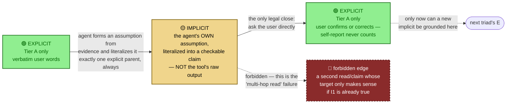
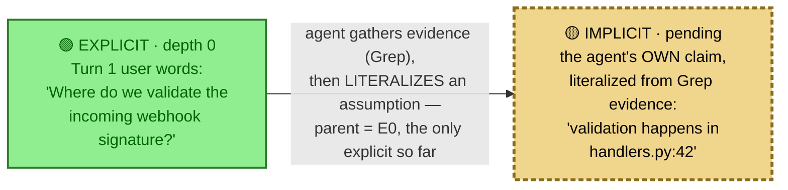
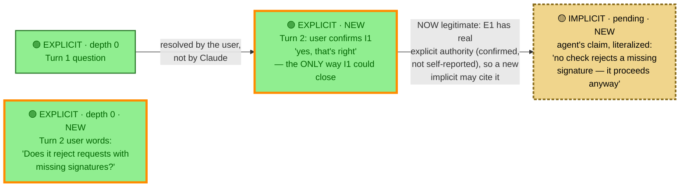
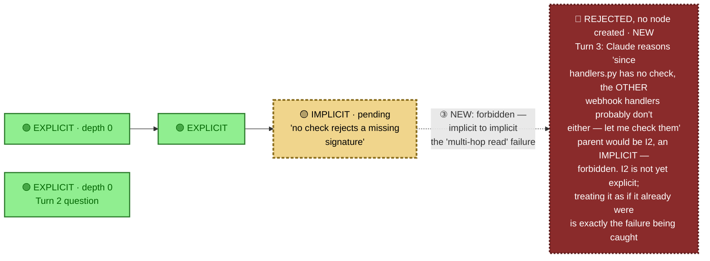
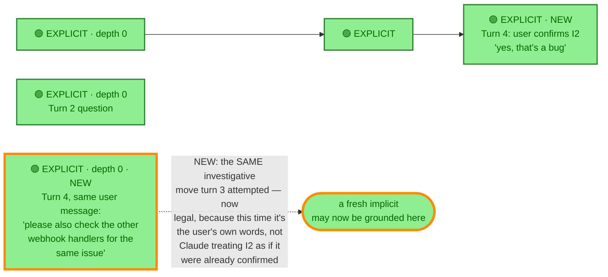

# The explicit/implicit/explicit tree, walked turn by turn

Captured 2026-09-17, **revised same day** — the first version of this document (and the atomic
motif it was built from, `diagrams/eie_triad_01_flowchart_motif_v1.mmd`) modeled the implicit node
wrong. This revision corrects it and supersedes both. The corrected motif lives at
`diagrams/eie_triad_02_flowchart_motif_v2.mmd`; v1 is left in place, not deleted, as a record of
the mistake.

## What was wrong, and why it matters

The first version treated a tool call's *raw output* as the implicit node, and let Claude's own
confident self-report close it into an explicit. Both are wrong, for the same underlying reason:

- **The implicit isn't the tool's output — it's the agent's own assumption, made into a literal.**
  `Grep` returning three matches is just evidence. The implicit is the claim Claude forms *from*
  that evidence ("validation happens at handlers.py:42") — the act of turning an internal
  assumption into a trackable, checkable statement. Evidence-gathering and claim-forming are
  different events; the first version conflated them.
- **Self-report is not closure.** `PLAN.md` decision #10 already settled this: *no implicit
  self-promotes to explicit under any condition — every implicit requires the user's own
  confirmation.* Letting Claude's self-report count as `E1` in the first version quietly broke that
  rule, and broke it in a way that compounds: once a self-reported claim is treated as explicit, a
  second implicit can legitimately cite it as parent — which means an unconfirmed assumption is now
  load-bearing for a second unconfirmed assumption, exactly the "assuming the correlation from the
  first read is explicit source" failure this revision exists to catch. **There is no self-report
  branch anymore. Every implicit closes exactly one way: the user confirms or corrects it.**

This also simplifies the model: the earlier version had a severity-based fork ("high severity goes
to ask, otherwise self-report"). That fork is gone. Every implicit is asked, always, regardless of
severity — severity might still affect *how urgently* or *how it's framed*, but never *whether* it
needs the user.

## The corrected atomic unit

**Hard rule, stated once so every diagram below can rely on it:** an implicit's parent is always an
explicit. Never another implicit. No exceptions for "it's basically confirmed" or "I'm confident
about it." An implicit only stops being a dead end once a real user turn closes it.

A consequence worth naming: because closure requires an actual user turn, **a triad can never
close within the same turn it opened in.** The turn that creates an implicit ends with it pending.
Only the next user message can resolve it — which is exactly why the walkthrough below has fewer
completed triads per turn than the first version did.

The tool-allowlist rule from the first version (only a sanctioned read tool like `Grep` may
execute; anything else is denied and its output stripped) is unchanged and not re-illustrated here
— it's a different concern (which *actions* are allowed to run) from what this revision fixes
(which *claims* are allowed to ground further claims).

---

## Turn 1 — the first claim, and it cannot self-close

**User:** "Where do we validate the incoming webhook signature?"

`E0` is registered verbatim. Claude calls `Grep('verify_signature')` — an action, not a node — and
gets real evidence back (three matches in `webhook/handlers.py`). Claude then forms its own
assumption from that evidence and literalizes it as `I1`. The turn ends there. There is no
mechanism by which Claude's own statement of `I1` becomes explicit — the turn simply ends with an
open implicit, waiting.

**State after turn 1:** one open implicit, nothing else explicit yet. The dashed border is doing
real work here — it means "not safe to build on."

---

## Turn 2 — a real confirmation, and now a second claim is legitimate

**User:** "Yes, that's right — does it reject requests with missing signatures?"

One message does two things: it confirms `I1` (closing it into `E1` — via the user, not Claude),
and it asks something new (`E2`, a fresh depth-0 explicit). Because `E1` is now genuinely explicit
— earned by confirmation, not asserted by Claude — a new implicit is allowed to cite it as parent.
Claude searches inside `handlers.py` (the file `E1` names) and forms a second claim: `I2`, "no check
rejects a missing signature." That claim is exactly as unconfirmed as `I1` was — it goes pending
the same way.

`E2` still has no outgoing edge — same tension flagged in the first version of this document, still
unresolved: the ledger only draws provenance edges, so it has nothing to say about *why* Claude went
looking, only about where the search's target actually came from (`E1`, not `E2`). Not fixed here;
still an open design question.

**State after turn 2:** one triad closed by real confirmation, a second implicit open.

---

## Turn 3 — the failure this revision exists to catch

Claude, without waiting for `I2` to be confirmed, reasons: *"handlers.py has no rejection check —
the other webhook handlers probably follow the same pattern, let me check them too."* That
reasoning treats `I2` as if it already had explicit authority. It doesn't. `I2` is still an
unconfirmed claim sitting in the ledger — grounding a new claim in it is exactly the
implicit-to-implicit edge the atomic motif marks as forbidden.

**State after turn 3: unchanged from turn 2 — that's the entire point.** Notice this isn't "the
wrong tool was used" (that's the separate, already-settled allowlist rule). The tool here could
even have been `Grep` again — the violation is purely about *what the new claim's authority was
supposed to come from*. `I3` never enters the tree.

---

## Turn 4 — resolution, and the same move done legitimately

**User:** "Yes, that's a bug — please also check the other webhook handlers for the same issue."

This closes `I2` into `E3` (real confirmation, same mechanism as turn 2). And in the same breath,
the user's own words authorize exactly the investigation Claude tried to jump to in turn 3 —
checking the other handlers. That becomes `E4`: a fresh, genuine, depth-0 explicit. The
investigative *idea* was never the problem. What was missing in turn 3 was authority, and now it
exists, sourced from the user instead of manufactured by Claude.

`I2` doesn't appear here anymore — it resolved into `E3`, so there's nothing left to show but the
closure. Same convention as the first version: a resolved node stops being drawn as itself and
becomes the explicit that replaced it.

**State after turn 4:** three real explicits earned by confirmation, one legitimate new mandate
(`E4`) ready to seed further implicits — this time honestly.

---

## What this revision does and doesn't settle

**Fixes, concretely:**
- Implicit = the agent's own literalized claim, never the raw tool output.
- No implicit ever cites another implicit as parent — illustrated as an actual rejected node
  (`I3`), not just asserted in prose.
- Closure is universal and single-path: the user confirms or corrects, always. No severity-based
  self-report shortcut survives from the first version.

**Still open, unchanged from before:**
- `E2`'s missing outgoing edge — the ledger still can't represent "why was this asked," only "where
  did the answer's target come from."
- How the "does this new claim's grounding actually trace to an implicit, not an explicit"
  check gets computed mechanically — this document asserts Claude "reasons" its way into the
  turn-3 violation, but doesn't specify what a real gate would inspect to catch that
  automatically. Still `PLAN.md` Open item 2's territory.

## Provenance

Fully hypothetical, same as the first version — no code was run, no ledger exists. All five
diagrams (the corrected motif plus four turns) were rendered against real `mermaid.js` via
`mermaid.ink` and confirmed to return valid PNGs before being embedded here; the images themselves
were not kept, only the validation result. This revision was written in direct response to a
correction from the user: the implicit node had been modeled as a tool call's output rather than
the agent's own literalized assumption, and closure had been modeled as self-report rather than
mandatory user confirmation — the latter a direct, if accidental, contradiction of `PLAN.md`
decision #10.
