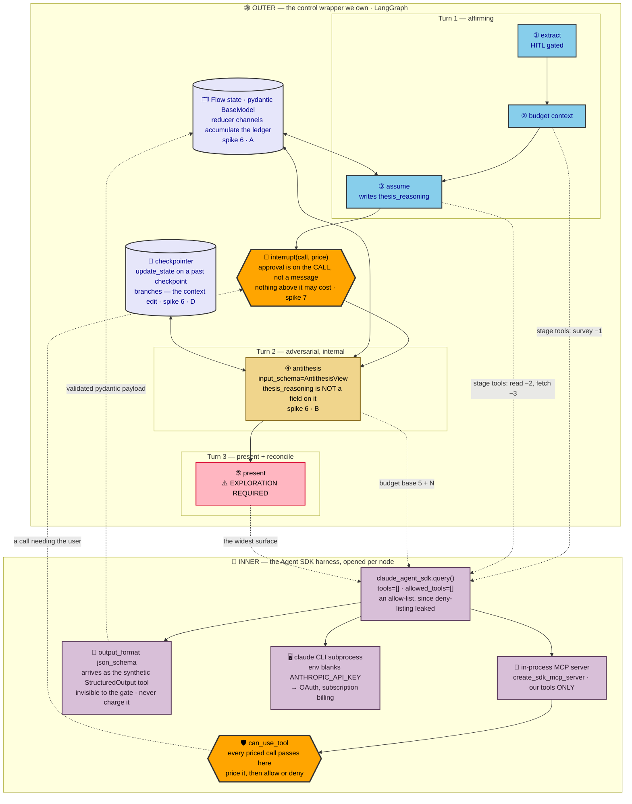
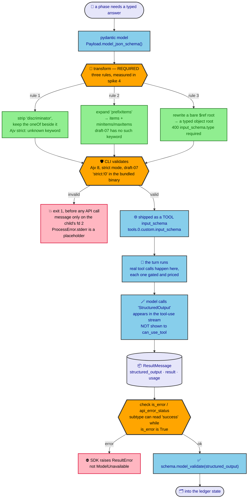

# Framework fit — what wraps the Agent SDK harness

Captured 2026-09-18. The Claude Agent SDK is fixed: it is how this project talks to Claude, because
it is what keeps the run on a subscription rather than on per-token API billing. That is settled and
already tested — this document does not re-examine it. The open question is what sits **around** it.

The framework's job here is not to supply an agent loop. It is to be the **wrapper of control**
around the SDK harness: stages as nodes, turns as boundaries, and semantic context state that we
own and can inspect. Both candidates were measured against that job, not against their marketing.

**Nothing here is built.** `src/` still runs the fixed-order pipeline recorded in
`docs/design/budgeted-flow-2026-09-17.md` §5. This document chooses the substrate that design will
be built on, and records what the substrate does and does not give for free.

## How to read this document

| Marker | Meaning |
|---|---|
| **M** | **Measured.** A spike in `scripts/spikes/` produced this output. Re-runnable; the command is in §11. |
| **R** | **Read.** Quoted from installed source or an executed binary, with a locator. Re-checkable. |
| **U** | **Unverified.** Believed, not tested. Listed in §10 so it cannot be mistaken for the other two. |

Every claim below carries one. Where a claim bears on the budgeted-flow design it names the
explicit or assumption it touches (**E**/**A**/**O** refer to that document's registers).

---

## 1. Executive summary

| Question | Answer |
|---|---|
| Which framework supplies the control wrapper? | **LangGraph.** It has all four control primitives the turn/stage structure needs; `pydantic_graph` 2.45 has one of them. **M** |
| Which supplies the model layer? | **Neither.** Nodes call `claude_agent_sdk` directly. Both alternatives cost either subscription auth or `can_use_tool`. **R** |
| Can a pydantic model be handed to the CLI as-is? | Almost. 8 of 11 constructs pass untouched; the other three need a three-rule transform, measured to repair all three. The cause is that the CLI validates with Ajv in strict mode and ships the schema as a *tool's* `input_schema`. **M** |
| Can one turn spend priced tool calls and return a typed payload? | Yes — and structured output arrives as a synthetic `StructuredOutput` tool call that `can_use_tool` never sees. **M** |
| What does the decision hinge on? | That a LangGraph node can be **structurally denied** part of the state. The antithesis boundary becomes a type declaration instead of an instruction. **M** |
| What is the cost of choosing LangGraph? | `langchain-core` arrives as a transitive dependency, and the interrupt-replay rule in §4.2 must be respected by every priced node. **R**/**M** |

---

## 2. Decision

**LangGraph is the control substrate. `claude_agent_sdk` is called directly inside the nodes.
Pydantic carries the state and every schema that crosses the SDK boundary.**

No chat-model abstraction is used at all: no `BaseChatModel`, no Pydantic AI `Model`. The framework
is used purely as a graph. That is what makes the choice cheap — the graph layer and the model layer
are decided independently, and only the graph layer is a framework question.



### What each layer owns

| Layer | Owns | Does not own |
|---|---|---|
| **Outer — the control graph** | stage order, which tools a stage has, the ledger state and its reducers, the turn boundary, approval, forking, durability | anything the model decides inside a stage |
| **Inner — the SDK harness, per node** | the model call, tool execution, the per-call gate (`can_use_tool`), subscription auth | when a stage ends, what the next stage is, what state survives |

The split is what makes **E29** ("graph tool availability is gated by stage") enforceable in two
places at once: the node decides *which* MCP server it opens, and `can_use_tool` decides whether any
individual call inside it is affordable and permitted.

---

## 3. Control-graph primitives — measured both ways

The same graph was built twice: a stage that assumes, a priced call needing approval, an antithesis
stage that must not inherit the affirming transcript, and a fork. No model is called in either — this
is substrate, not behaviour. **M** (`spike_06_control_graph.py`, `spike_08_pydantic_graph_control.py`)

| Mechanism the design needs | LangGraph 1.2.11 | pydantic_graph 2.45 |
|---|---|---|
| Typed state that accumulates | **pass** — pydantic state + `Annotated[list[str], operator.add]` reducers | **pass** — typed state mutated in place; no reducer or channel concept |
| A node **structurally denied** part of state | **pass** — `add_node(..., input_schema=AntithesisView)` | **fail** — `StepContext.state` is the whole `StateT` |
| Suspend on a call, resume by value | **pass** — `interrupt()` / `Command(resume=...)` | **fail** as a primitive — `iter()` / `next()` / `override_next()` is a manual seam |
| Fork from a chosen prior point | **pass** — `get_state_history()` + `update_state(as_node=)` | **fail** — nothing persisted to fork from |
| Score | **5/5** (the resume is counted separately) | **1/4**, or 2/4 if the manual stepping seam is counted for the third row |
| Renders itself | `get_graph()` | `render()` → mermaid `stateDiagram-v2`, which is a real convenience given this repo's diagram discipline |

### 3.1 The result the decision rests on

**E27a** says the antithesis exists to force the agent to examine its own assumptions, and that the
two frames cannot share a task. Under LangGraph that stops being an instruction and becomes a type.
The antithesis node declares `input_schema=AntithesisView`, and the spike recorded what the node
actually received: **M**

```
the antithesis node received fields ['assumptions', 'spent']
while the full state still carries thesis_reasoning=['I felt confident because phases.py says so']
```

`thesis_reasoning` is not an attribute of the object handed to that node. The affirming transcript
is not hidden from the model by a prompt asking it to ignore something — it is absent from the type,
so no node body can reach it and no prompt built from that node can contain it. That is the
structural unbiasing the design claims, enforced by the graph.

`pydantic_graph` narrows the **edge payload** instead. Steps are typed on their input, so the
antithesis step receives a narrow `Crossing`, which is genuinely good typing — but `ctx.state` is
still the whole `Flow`: **M**

```
the step's input type was 'Crossing' (narrow),
but ctx.state exposes thesis_reasoning=True
```

The boundary is reachable there too, by never putting the transcript in state and threading it only
along edges. But then it is a convention the author keeps, not a wall the framework holds. For a
design whose central claim is that the separation is structural rather than instructed, that
difference is the whole point.

### 3.2 Approval on the call — and a rule for priced nodes

**E28** distinguishes a user message from a user approval of a tool call. `interrupt()` is that
second surface exactly: the node names the call it wants and suspends; the run resumes with a value
threaded back into the same node. Measured payload and result: **M**

```
paused with : {'call': 'read', 'path': 'session/runner.py', 'price': 2}
resumed     : approved=['approved-by-user'] spent=7   (5 + 2)
```

**The trap, and it matters here specifically.** Resuming re-runs the node from the top. The spike
instrumented both sides of the wait: **M** (`spike_07_interrupt_replay.py`)

```
side effects, in order : ['above-the-wait', 'above-the-wait', 'below-the-wait']
committed debits       : [2]
```

The body above `interrupt()` ran twice; the state update committed once. So:

> **A priced node debits by returning state, never by performing a side effect above the wait.**
> No ledger write, no file append, and no priced SDK call may sit above an `interrupt()`.

This is the same hazard `langchain-claude-cli` already hit from the other direction — its MCP handler
carries the comment `# Idempotent delivery (spike S1b: may be invoked twice)`
(`_options.py:146`). **R** Worth treating as a property of gated agent plumbing generally rather than
a quirk of one library.

### 3.3 Fork as the context edit

The turn boundary in **E27b** is a context edit: turn 2 must not be able to see turn 1's affirming
transcript. Writing to a *past* checkpoint branches rather than overwrites, which is exactly that
operation on a persisted run: **M**

```
5 checkpoints; forked at next=('gate',)
branch <id> from <id> (compared in full)
```

So the boundary has two independent enforcements, which is the right number for a claim this load-
bearing: `input_schema` makes the transcript unreachable from the node, and the fork makes it absent
from the state the node's turn runs against.

### 3.4 Durability

LangGraph ships checkpointers (`langgraph-checkpoint` 4.2.0, serialising via `ormsgpack`). **R**
`pydantic_graph` 2.45 exports nothing matching `persist` or `snapshot` across 56 names — state is a
plain object the caller stores, and durability comes from Pydantic AI's `durable_exec` integrations
(`temporal`, `dbos`, `prefect` subpackages). **M**/**R** For a design that pauses for a human between
turns, durability is not optional, and those three integrations are a heavier commitment than a
checkpointer.

---

## 4. Structured output — can a pydantic model go in as-is?

`output_format={"type": "json_schema", "schema": ...}` is the only structured-output mechanism the
Claude Code surface has; there is no `tool_choice` forcing and no `response_format`
(`claude_agent_sdk/types.py:2334-2340`). **R** The answer arrives on `ResultMessage.structured_output`
(`types.py:1353`). **R**



### 4.1 What the CLI accepts

The bundled binary validates with Ajv in strict mode — `strict:!0` appears 14 times, alongside
`strictSchema` (17), `strictTypes` (12) and `strictTuples` (9). **R** Measured against a schema per
construct, so a rejection names exactly one thing: **M** (`spike_04_structured_output.py`)

| Construct | Verdict |
|---|---|
| nested models (`$defs`/`$ref`), enum, `Literal`, `str \| None`, numeric and list bounds, `additionalProperties:false` | accepted |
| untagged union (`anyOf`) | accepted |
| `AnyUrl` / `datetime` / `UUID` formats | accepted |
| `Decimal` | accepted |
| `dict[str, int]` | accepted |
| fields with defaults (partial `required`) | accepted |
| `str` with `pattern` | accepted |
| recursion behind an object root | accepted |
| `Field(discriminator="kind")` | **rejected** — `strict mode: unknown keyword: "discriminator"` |
| `tuple[int, str]` | **rejected** — `strict mode: unknown keyword: "prefixItems"` |
| self-referencing model at the root | **rejected** — `API Error: 400 tools.0.custom.input_schema.type: Field required` |

8 of 11. A realistic ledger-shaped schema — nested `Locator`, a four-value register enum, a
`Literal` verdict, an `anyOf`-null note and bounded lists — round-tripped and re-validated with no
transform at all. **M**

Two mechanisms are visible in those rejections:

- **`prefixItems` being unknown dates the vocabulary.** It is a 2020-12 keyword, so the validator is
  running draft-07, which also explains why `discriminator` (an OpenAPI keyword pydantic emits for
  tagged unions) is refused rather than ignored. **M**
- **`tools.0.custom.input_schema.type` names the transport.** The schema is shipped as a tool's input
  schema, so it must be a typed object at the root. Recursion itself is fine: wrapping the same
  recursive model behind an object root returns
  `{"tree": {"label": "a", "kids": [{"label": "b"}]}}`. **M** The blocker is the bare `$ref` root
  pydantic emits for a self-referencing model, not the self-reference.

### 4.2 The three transforms

Framework-independent, because they are properties of the CLI:

1. **Strip `discriminator`**, keep the `oneOf` it sits beside — pydantic emits `oneOf` for a tagged
   union, not `anyOf`. The keyword is a parsing hint for whoever reads the schema; pydantic still
   applies the discriminated validator on the way back in, so nothing is lost.
2. **Expand `prefixItems`** into `items` plus `minItems`/`maxItems`. Positional typing is genuinely
   lost — a fixed-length array of a union is weaker than a tuple — so prefer keeping tuples out of
   wire schemas; the rule exists so the failure is a downgrade rather than a crash.
3. **Rewrite a bare `$ref` root** into the referenced object, keeping `$defs` so the recursion inside
   it still resolves.

All three are measured, not proposed: part C of spike 4 applies them to the three rejected schemas
and ships them. **M**

```
REPAIRED  tagged union — discriminator stripped   {"x": {"kind": "a", "v": 42}}
REPAIRED  tuple — prefixItems expanded            {"pair": [1, "done"]}
REPAIRED  recursion — $ref root inlined           {"label": "Root", "kids": [{"label": "Child 1"}, ...
```

Each reply is then validated against the **untransformed** pydantic model, which is the property
that matters: the transform changes the wire schema, never the type the ledger keeps. The three rules
are about sixty lines in `spike_04_structured_output.py` and are the reference implementation until
they move into `src/`.

Neither candidate framework does this for you today, but they are not equally placed. Pydantic AI
ships `JsonSchemaTransformer` — an ABC that walks a schema, inlines `$defs`, tracks `recursive_refs`,
and already has handling for `prefixItems` and a comment about preserving `discriminator`
(`pydantic_ai/_json_schema.py:16, 51, 175, 199, 226`). **R** `langchain-claude-cli` passes
`pydantic_schema.model_json_schema()` straight through (`chat_models.py:384-385` into `:409`). **R**
Since the chosen architecture uses neither for the model layer, the transform is ours — and that ABC
is the right shape to grow into if the rules multiply.

### 4.3 Tool use and a typed payload in one turn

The stages need both: look things up under a quota, then register what was found. They are not
exclusive. One turn with an MCP tool and `output_format` produced: **M**
(`spike_05_tools_and_structured_output.py`)

```
tool calls in the model's stream : ['mcp__shop__lookup_price', 'mcp__shop__lookup_price', 'StructuredOutput']
calls shown to can_use_tool      : ['mcp__shop__lookup_price', 'mcp__shop__lookup_price']
structured_output                : {"apple": 3, "pear": 7, "tool_calls_made": 2}
```

So a stage does not have to split into two turns for a mechanical reason. Where the design does split
turns — **E27b** — it is for the design's own reason, which is the right way round.

### 4.4 `StructuredOutput` is a tool, and must not be priced

The third entry in that stream is the mechanism showing through: structured output is delivered as a
synthetic tool call the model makes at the end of the turn. It is visible in the model's tool-use
stream and **absent from `can_use_tool`**. **M** Two consequences for **E5** (a budget decrements per
call):

- **Price only the calls `can_use_tool` is consulted about.** Counting tool-use blocks would bill the
  ledger for its own bookkeeping.
- **It cannot be gated.** Any rule of the form "every tool call passes the gate" is false for this one
  call, and a gate-based invariant must say so explicitly rather than be quietly wrong.

### 4.5 One repair in existing code

`SdkModel.structured` reads `msg.errors` and `msg.result` but never `is_error` or `api_error_status`
(`src/langchain_claude_test/session/model.py:182-186`). **R** On the measured 400, `subtype` was
`'success'`, `is_error` was `True` and `errors` was `None` — so a schema the API rejects looks like a
parse failure, and the SDK's own `ResultError` escapes `structured()` uncaught rather than as
`ModelUnavailable` (`model.py:213` catches only `JSONDecodeError`/`ValidationError`). **M**/**R**
Small, and worth fixing whenever that file is next touched.

---

## 5. Why Pydantic AI cannot hold the model layer here

Not a judgement on the library, which is good. Three facts, in order of how much they decide:

1. **Its Anthropic provider is API-key only.** `AnthropicProvider.__init__` takes `api_key`, falls
   back to `ANTHROPIC_API_KEY`, and raises `missing_api_key_error` without one
   (`pydantic_ai/providers/anthropic.py:159-162`). **R** There is no OAuth or subscription path, and
   the absence is a choice rather than an oversight: they built a full authorization-code + PKCE flow
   for the *ChatGPT/Codex* subscription (`models/openai_codex.py`, `providers/_oauth.py`) and no
   equivalent for Claude. **R**
2. **The maintainers are steering people off this transport.** The installed package ships
   `.agents/skills/migrating-claude-agent-sdk-to-pydantic-ai/`, whose cutover step reads: *"Remove
   `claude-agent-sdk` only after no retained path imports it, spawns Claude Code, reads its
   transcripts, or consumes its event/result types."* **R** Building on it here would mean
   maintaining a `Model` subclass against exactly the dependency that skill exists to delete.
3. **Its structured output defaults to tool emulation.** `supports_json_schema_output` defaults to
   `False` and `default_structured_output_mode` to `'tool'`
   (`pydantic_ai/profiles/__init__.py:226-232`). **R** Correct for the general case, and beside the
   point here: the CLI's native `output_format` already is the mechanism, so the framework would be
   re-deriving something the transport does natively.

The honest credit: `JsonSchemaTransformer` (§4.2) and the `ApprovalRequired` /
`DeferredToolRequests` / `ApprovalRequiredToolset` surface are both well shaped, and the second maps
neatly onto **E28**. **R** Neither is worth the model layer.

## 6. Why `langchain-claude-cli` cannot hold it either

This one is closer, and its bridge is genuinely clever. It exposes LangChain tools to the CLI as an
in-process MCP server (`_options.py:136-163`), then registers a `PreToolUse` hook that returns
`permissionDecision: "defer"` (`:187`), which stops the run and hands the call back on
`ResultMessage.deferred_tool_use` (`claude_agent_sdk/types.py:1300-1311`) so the host can execute it
and replay the result on the next turn. **R** That is the bridge that makes LangChain's
host-executes-tools contract work over a subprocess that wants to run its own loop.

It is also why `grep -rn can_use_tool` over the whole package returns **nothing**: **R** the hook slot
is spent. `_options.py:240` assigns `options.hooks` wholesale to the defer machinery. Under the
architecture in §2, `can_use_tool` is where a call gets priced and gated — it is the seam the control
wrapper exists to hold. A dependency that consumes it is trading away the thing being bought.

Two smaller notes: it does already do the right thing on auth (blanking the API-key env vars) and on
isolation (`tools = []` at `_options.py:219`, an allow-list rather than a deny-list, which matters
because of **O11**). **R** And it is currently declared in `pyproject.toml` and imported nowhere —
`src/` reaches `claude_agent_sdk` directly (`session/model.py:146`). **R**

## 7. Dependency change

| Action | Package | Why |
|---|---|---|
| add | `langgraph` (1.2.11) | the control substrate |
| keep | `claude-agent-sdk` | the transport, called directly from nodes |
| keep | `pydantic` | state, and every schema crossing the SDK boundary |
| remove | `langchain` | the agent/middleware layer is unused under §2 |
| remove | `langchain-claude-cli` | consumes `options.hooks`; see §6 |
| do not add | `pydantic-ai-slim` | see §5; `spike_08` runs it out of project to keep this justified |

`langgraph` pulls `langchain-core`, `langgraph-checkpoint`, `langgraph-prebuilt`, `langgraph-sdk`,
`ormsgpack` and `xxhash`. **R** `langchain-core` arrives transitively and unavoidably; it is the small
one, and nothing in `src/` need import it.

A naming collision worth noting so notes stay readable: `pydantic-ai-harness` is a real package
(0.31.0 on PyPI) — Pydantic AI's own coding-agent layer. **R** When this project's notes say "the
harness", they mean the Claude Agent SDK.

## 8. Consequences for the budgeted-flow design

| Design item | What this changes |
|---|---|
| **E27a**, **E27b** — the frames cannot share a task | Becomes a type: the antithesis node's `input_schema` omits the affirming transcript (§3.1), reinforced by the fork (§3.3). Stops being a prompt instruction. |
| **E27c** — the antithesis is a node | Literal, not analogical: it is a graph node with its own `input_schema` and budget. |
| **E28** — message and approval are different surfaces | `interrupt()` is the approval surface; the node names the call, the user resumes with a value (§3.2). |
| **E29** — availability is gated by stage | Enforced twice: the node chooses which MCP server it opens, and `can_use_tool` gates each call inside it (§2). |
| **E5** — a budget decrements per call | Count only what `can_use_tool` sees. `StructuredOutput` is a tool call that is neither gateable nor chargeable (§4.4). |
| **E25** — the agent never sets values | Reducer channels are graph-set; a node returns a delta and the graph merges it. The agent cannot widen its own cap. |
| **A11** — `supersedes` is load-bearing | Unchanged by this document, but note that accepting an antithesis is a state update on a reducer channel, not an in-place edit. |
| **A12** — staged availability needs the built-in surface off | **Strengthened into a hard dependency.** `tools=[]` plus in-process MCP is the only configuration under which §2's inner layer means anything, and **O11** records that deny-listing leaked. |
| **New rule** | A priced node must not perform side effects above an `interrupt()` (§3.2). |

## 9. What this does not decide

- **Stage ⑤ is still exploration required** (**E32**, and **X1**–**X7** in the budgeted-flow doc).
  This document says what substrate the stage will be built on, not what it does.
- **Prices and budget values** are unchanged and still the user's to set.
- **Whether the antithesis view is the right projection.** `AntithesisView` in the spike carries
  `assumptions` and `spent`. The real projection is a design question — the finding is only that a
  projection can be declared and enforced.

## 10. Unverified

- **U** — pydantic state through a *persistent* checkpointer. `InMemorySaver` was measured;
  `ormsgpack` serialisation of pydantic models through the SQLite or Postgres savers was not.
- **U** — whether the CLI's Ajv instance is configured with a custom keyword allowlist. `$defs` is
  accepted while `prefixItems` is not, which is consistent with Ajv 8 draft-07 (whose core vocabulary
  includes `$defs`), but the configuration was inferred from behaviour plus the `strict:!0` strings,
  not read from the minified bundle.
- **U** — whether `StructuredOutput` counts against `max_turns` or any SDK-side budget. It occupies a
  slot in the model's tool-use stream; what else it counts against was not measured.
- **U** — the cost of a Pydantic AI `Model` subclass over the Agent SDK. §5 argues it should not be
  paid; it was not attempted, so the estimate is not evidence.
- **U** — whether `pydantic_graph`'s `GraphRun.next()` / `override_next()` seam could carry a durable
  HITL pause acceptably. It was exercised only far enough to confirm it is a manual seam.

## 11. Spikes — how to re-run

Everything marked **M** comes from these. The first two spend subscription tokens on Haiku; the last
three cost nothing.

```bash
# schema acceptance (8/11, rejections quoted from the CLI) + the transform that
# repairs all three, with replies still validated against the original model
.venv/bin/python scripts/spikes/spike_04_structured_output.py

# priced tool calls and a typed payload in one turn; StructuredOutput's invisibility
.venv/bin/python scripts/spikes/spike_05_tools_and_structured_output.py

# the four control primitives under LangGraph — 5/5, no model calls
.venv/bin/python scripts/spikes/spike_06_control_graph.py

# interrupt replay, and where a debit is safe — no model calls
.venv/bin/python scripts/spikes/spike_07_interrupt_replay.py

# the same primitives under pydantic_graph — 1/4, out of project by design
uv run --with pydantic-ai-slim --no-project --python 3.14 \
    python scripts/spikes/spike_08_pydantic_graph_control.py
```

Spikes 1–3 are earlier work and unchanged: tool isolation, UI render, and a live round.

## 12. Provenance

**Measured this session, 2026-09-18**, against `claude_agent_sdk` 0.2.153 and its bundled CLI
2.1.273, `langgraph` 1.2.11, `langchain-core` 1.6.3, `pydantic` 2.13.5, and
`pydantic-ai-slim` / `pydantic-graph` 2.45.0 installed into a throwaway environment. Model for every
live call: `claude-haiku-4-5-20251001`.

**Read directly from installed source**: `claude_agent_sdk/types.py` (`:278-280`, `:1300-1311`,
`:1353`, `:2334-2340`), `claude_agent_sdk/_internal/transport/subprocess_cli.py:812`,
`claude_agent_sdk/_errors.py`; `langchain_claude_cli/_options.py` (`:136-163`, `:146`, `:187`,
`:219`, `:240`) and `chat_models.py` (`:384-385`, `:409`); `pydantic_ai/providers/anthropic.py:159-162`,
`pydantic_ai/models/openai_codex.py`, `pydantic_ai/providers/_oauth.py`,
`pydantic_ai/_json_schema.py` (`:16`, `:51`, `:175`, `:199`, `:226`),
`pydantic_ai/profiles/__init__.py:226-232`, `pydantic_ai/profiles/anthropic.py:208`,
`pydantic_graph/step.py:26-51`, `pydantic_graph/graph_builder.py` (`:240`, `:313`, `:1139`);
`src/langchain_claude_test/session/model.py` (`:146`, `:182-186`, `:213`) and `session/phases.py:3`.

**Executed directly**: `strings`-style grep over the bundled `claude` binary for the Ajv strictness
flags; `python -c` introspection of `StateGraph.add_node` / `CompiledStateGraph.get_state_history` /
`update_state` signatures; PyPI metadata for `pydantic-ai` 2.45.0, `pydantic-ai-harness` 0.31.0,
`claude-agent-sdk` 0.2.156, `langchain-claude-cli` 1.2.1, and `langgraph` 1.2.11's dependency list.

**Not re-tested, per instruction**: that the Agent SDK on blanked API-key env vars bills the
subscription rather than per token. Taken as settled.

## 13. Diagrams

| # | File | Shows |
|---|---|---|
| 1 | `diagrams/framework_fit_01_architecture_two_level.mmd` | the control graph outside, the SDK harness inside, and which layer owns what |
| 2 | `diagrams/framework_fit_02_activity_structured_output.mmd` | a pydantic model's path to a validated payload, with the three transforms and the synthetic tool call |

Both parse against mermaid 12 (`mermaid.parse()`, no browser). Both are embedded above verbatim; the
`.mmd` files are the source of truth.
