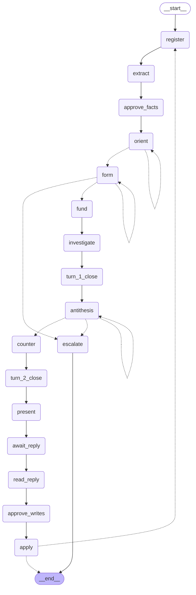

# graph_v2 — the budgeted-flow control graph

**Status: stage 1 of a gated build. Architecture only — it does not call a model.**

The design this implements is `docs/design/budgeted-flow-2026-09-17.md`; why it is built
on LangGraph is `docs/design/framework-fit-2026-09-18.md`. Neither is needed to read this
file or the code: where a rule came from the user, the user's words are quoted where the
rule is enforced, rather than cited by a code that only resolves somewhere else.

---

## Your answers — the root

Everything below derives from these. Quoted verbatim, typos kept, because a paraphrase of
an instruction is already an interpretation of it.

### On all the numbers

> "All of the numbers will need to be tested and tweaked, and there is a reasonable case
> for a settings file upload for persona types, where some are heavy thinkers and others
> dont need that much. So in this sense, we can just pick defaults but make sure to not
> that they are not set."

**What this changed.** Every cap now has a value, so the loop runs end to end. Nothing
refuses for want of a number any more. In exchange, `context.py` carries two machine-readable
sets — one naming the three numbers that are yours, one naming every value that is a
placeholder — and `provisional_fields()` hands the second to whatever wants to display it.
The distinction is data rather than a comment because the settings layer has to be able to
show which numbers nobody chose.

**The persona seam.** `Budgets.from_mapping(data, persona=...)` takes a settings file's
parsed contents, one block per persona, where a block states only what it changes. The file
format is undecided and **no persona but `default` is defined in code** — deliberately, so
that inventing a heavy-thinker's numbers here could not be mistaken for having chosen them.

### On whether fact extraction costs budget

> "In terms of 10. I think we can put this to the side for now. The fact extraction has
> more nuance at the moment than i anticipated, so I'd like to see a working base loop
> before extending the finer details."

**What this changed.** The extraction stage runs on a placeholder budget and the simplest
contract that works — one pass, candidate spans out, each one put to you for approval. Its
design is parked, not just its price, and the node says so where it is defined. The stated
priority, a working base loop first, is now what the stage plan at the bottom is ordered by.

### On whether the present-and-reconcile stage has a budget

> "11. delay for now, but no this is just a analyze and report stage at the moment."

**What this changed.** This is an answer, not a placeholder: the stage gets **no budget**,
and the two nodes in it open no pool at all. That means the gate refuses every priced call
rather than a prompt asking the model not to look things up — the stage cannot go and read
things, structurally. It analyses what the cycle already gathered and reports it. "At the
moment" is your word, so this is current rather than permanent.

### On everything else

> "The rest of these things are far to detailed for this statge in the design."

**What this changed.** Nothing is left refusing to run. Each deferred item now has a
placeholder that is named as one, listed under *Deferred* below.

---

## What is here

| File | Owns | Lines |
|---|---|---|
| `context.py` | caps, prices, the harness — runtime context, so nodes read and never write | 249 |
| `state.py` | the records, which channels accumulate, and the checkpoint allowlist | 400 |
| `views.py` | **what each node may see.** The file the framework was chosen for | 265 |
| `surface.py` | which graph-writes exist in which stage | 119 |
| `budget.py` | spend arithmetic, derived from the recorded ledger | 149 |
| `harness.py` | the one model call: allow-listed tools, the meter, the typed payload | 379 |
| `nodes.py` | the stages — each with its view and its payload | 802 |
| `graph.py` | the edge list. The flow *is* this object, not a docstring about one | 272 |

## The topology

17 nodes, 3 turns, 5 stages. Generated by `graph_v2.render()` from the compiled graph, so
it cannot drift from the edge list — which is why there is no hand-authored `.mmd` for it,
unlike the design diagrams in `diagrams/`.

Three self-loops, and each is a design requirement rather than a retry: `orient` runs
another wide turn while the agent cannot yet name the readings worth exploring; `form`
re-authors an assumption nothing could land on; `antithesis` re-authors when it fails to
attack anything, because *"there is nothing to attack"* is not a permitted output.

## Decisions taken at stage 1

These weren't dictated by the design. Each is a choice the code now depends on, so each is
something to agree with or overturn.

| # | Decision | Why, and what it costs |
|---|---|---|
| **D1** | **State stores plain data records; the network graph is rebuilt from them on demand.** | The existing ledger code says the graph itself is the store. This reverses that, because the state is saved after every step and can be branched from any past point, and a live graph object is neither serialisable nor forkable. Cost: anything that wants to walk the graph builds it first. |
| **D2** | **Budget caps live outside the state, in a per-run config object. Only spending goes in the state.** | A step's only power is the data it hands back, so a cap that isn't in the state is a cap no agent can touch. It makes *"the agent can never set their own values"* a property of the types rather than a rule to police. |
| **D3** | **One step of the graph is one whole conversation with the model — not one tool call.** | A single conversation can spend many priced calls and still return a structured answer; that was measured on a live call. Stepping per tool call would start a fresh subprocess mid-stage and discard the model's working context between calls. |
| **D4** | **No step both spends budget and waits for you.** Enforced by `check_topology()`. | When a paused step resumes, everything above the pause runs again while the saved data commits once — measured. A step doing both would re-spend on every resume. This is why extraction and approval are two steps. |
| **D5** | **The turn boundary is a step that builds a hand-over object, and evidence changes type as it crosses.** | Each finding normally carries a field holding *why the agent thought it mattered* — the affirming frame in one field. The version that crosses is a different type with no such field, so it cannot leak by accident rather than by someone remembering to strip it. |
| **D6** | **All branching lives in the edge list, never returned from a step body.** | The framework's "go to X" return value *adds* a route without removing the wired one, so a step with both runs both destinations. Keeping branches in the edge list also keeps them in the generated diagram. |
| **D7** | **Every pause is the step itself announcing which call it wants approved.** | The generic "stop before this step" switch stops *before* a step and so has nothing to say. It would collapse the difference between a user message and a user approval of a tool call. |
| **D8** | **This package sits beside the existing pipeline rather than replacing it.** | The old fixed-order pipeline works and its tests deliberately encode its contract. Deleting it before this runs trades something working for something that doesn't. |

## Deferred — placeholders in force, each marked as one

Deferred on your instruction that *"the rest of these things are far to detailed for this
statge in the design."* None of them blocks a run; each is a named placeholder rather than
a silent default, and each is listed in `PROVISIONAL` in `context.py` or beside the code
that uses it.

| What is undecided | Placeholder in force | Where |
|---|---|---|
| How many points the wide orientation pass gets | 5 — chosen because a number was needed, matching the adversarial base only by coincidence, not because the two were judged the same | `context.py` |
| Who caps how many assumptions may be formed. The turn is funded at five per reading and the next at base plus the reading count, so an agent choosing the count freely would be choosing its own budget | ceiling of 3, taken from the worked example and used as a ceiling rather than a target | `context.py` |
| What bounds re-authoring, and where an exhausted loop rejoins | 2 attempts, then a step that asks you — because every other option decides something | `context.py`, `nodes.py` |
| Whether the graph's own bookkeeping writes are priced, or only evidence calls | 0, in one field, so the question stays in one place | `context.py` |
| Whether compressing or discarding needs your approval | yes — the direction whose failure mode is friction rather than silent loss | `surface.py` |
| What survives compaction, and in what form | unbuilt; the step that applies approved changes refuses | `nodes.py` |
| Where a new message enters the flow for the next cycle | the run ends after one cycle rather than looping on a guess | `nodes.py` |
| The in-graph tool names themselves | listed as a shape, flagged in the file as not settled | `surface.py` |
| Where saved state lives beyond the process | in-memory only | `graph.py` |

**One of these will block the next stage and is worth flagging now.** The restriction is
*per assumption*, while all the readings' findings are registered *in one turn*. Both can
only hold if one conversation draws down several separate budgets, which means every priced
call has to declare which reading it serves. The gate therefore takes one pool per
assumption and no fallback, and refuses any call naming none rather than charging it
somewhere convenient. That is a constraint on how the tools are shaped, so it wants
agreeing before they are written.

## Verified, not asserted

Nine checks, against langgraph 1.2.11, pydantic 2.13.5, python 3.14.

| Claim | How |
|---|---|
| The graph compiles and renders itself | `graph_v2.render()` |
| No step both spends and pauses; no view names a field the state lacks; no record type is missing from the checkpoint allowlist; no step is unreachable | `graph_v2.check_topology()` → no problems |
| The adversarial steps' views name none of the affirming transcript, the full findings, the explicits, the prompt or the assumptions | field-set comparison |
| The boundary step drops *why this mattered* and the transcript from what crosses, while the full state keeps both | ran the step on a populated state |
| Budget arithmetic: 23 points a cycle at three readings, 35 at five | `budget.cycle_total` |
| Every cap is classified as yours or as a marked placeholder, and none is unclassified | `unclassified_budget_fields()` → none |
| The run pauses at fact approval with the **call** named, and a denial parks with its reason, then advances on defaults | stub harness, in-memory checkpointer, resume-by-value |
| A populated state survives save-and-reload under the framework's strictest serialisation setting | `serializer()`, 11 allow-listed types |
| The present stage opens no pool at all, and appends the budget-asymmetry disclosure | ran the step with a recording harness |

**One thing worth knowing, found while checking.** Saving custom record types warns once per
type — *"This will be blocked in a future version"* — and refuses outright under the
framework's strict setting. `state.RECORD_TYPES` plus `graph.serializer()` is the fix, and
`check_topology()` keeps the list from drifting. Storage that outlives the process is still
untested; this design pauses for a human between turns, so it will need some.

## Deliberately not built

Each raises an error naming its stage rather than returning something plausible. A scaffold
that silently produces answers is the failure mode this project exists to catch.

- **the real model turn** — the whole inner layer, next stage
- **which pool pays and which price class applies** — waits on the tool names and on the
  per-call attribution question above
- **the wire-schema repair** — a mechanical port of about sixty already-measured lines from
  `scripts/spikes/spike_04_structured_output.py`
- **applying approved changes to the graph** — waits on the compaction policy
- **looping into the next cycle** — waits on where a new message enters
- **every prompt but two** — the adversarial container is your words verbatim; the present
  container is paraphrased from your description and marked as such

## Proposed next stages

Ordered by your priority: *"I'd like to see a working base loop before extending the finer
details."* Each is gated; nothing starts without a go.

- **Stage 2 — make the loop turn over.** Implement the model turn over the Agent SDK: the
  in-process tool server carrying one stage's surface, the meter as the permission callback,
  the wire-schema repair, and a scripted stand-in beside the real one for replay. The
  per-call attribution question above lands here.
- **Stage 3 — the tools and the prompts.** The in-graph write tools, the price classes, and
  the prompt containers.
- **Stage 4 — durability and the branch.** Storage that outlives the process, and the
  context edit as a write to a chosen earlier checkpoint.
- **Stage 5 — the present stage.** Still exploration rather than build.
